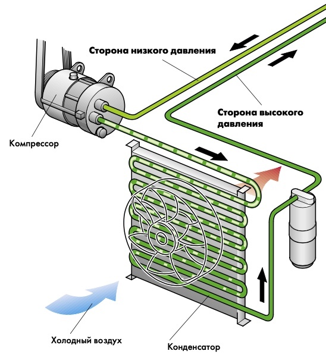
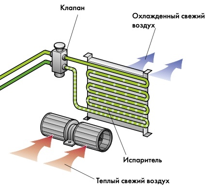
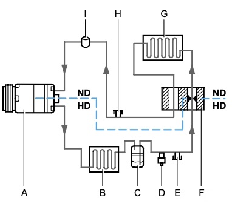
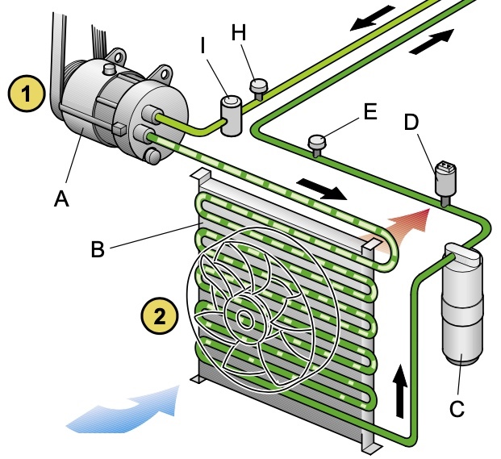
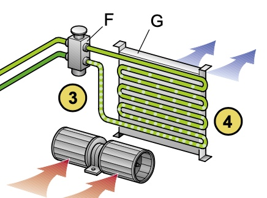
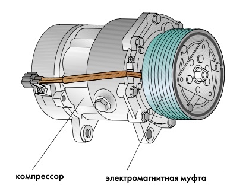
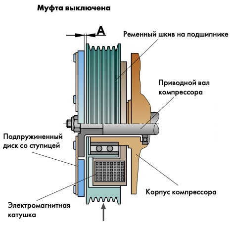
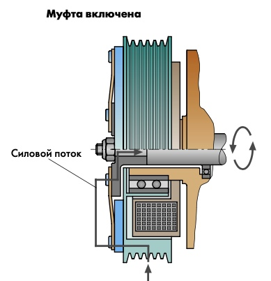

### Автомобильные климатические установки

#### Физические основы
Многие вещества имеют три агрегатных состояния. Например, вода: твердое, жидкое и газообразное. 

Газообразное вещество посредством охлаждения опять превратится в жидкость, при дальнейшем охлаждении оно примет твердую форму.  
Такая закономерность присуща почти всем веществам:  

- **вещество при переходе из жидкого состояния в газообразное поглощает тепло**;  
- вещество при переходе из газообразного в жидкое состояние отдает тепло;  
- тепло всегда переходит от теплого вещества к холодному веществу.  

Эффект теплообмена, при котором вещество при определенных обстоятельствах изменяет свое состояние, используется в хладотехнике.

Если изменяется давление на жидкость, тогда изменяется точка кипения жидкости.  
Все жидкости ведут себя одинаково.
Точка кипения:  

- вода = 100 градусов C 
- машинное масло = 380 – 400 градусов C  

По поведению воды нам известно, что чем выше давление, тем выше точка кипения.

Процесс парообразования используется в автомобильных климатических установках. Для этого применяют вещества с низкой температурой кипения. Такие вещества называются хладагентами.
Точка кипения:  

- хладагент R12 = -29,8 градусов C (R12 больше не применяется)
- хладагент R134a = -26,5 градусов C  

#### Хладагент
Хладагент для автомобильных климатических установок с низкой температурой кипения представляет собой газ.  
Это газ невидим, поскольку в газообразном и жидком состоянии он бесцветен, как вода.  
Хладагенты не должны быть смешаны; для каждого типа климатической установки следует использовать соответствующий хладагент.

В современных автомобильных климатических установках используют исключительно хладагент R134a.

В зависимости от величины давления и температуры в контуре хладагента сам хладагент находится в газообразном или жидком состоянии.

#### Холодильное масло
Для смазки всех движущихся частей в климатической установке применяется специальное масло – холодильное масло, которое свободно от загрязняющих частиц: серы, воска и влаги.

Такое масло должно быть нейтральным по отношению к хладагенту, поскольку он в какой-то степени подмешивается к хладагенту и вместе с последним перемещается по контуру хладагента; при этом не должно быть агрессивного воздействия на уплотнения.

Распределение масла в контуре хладагента (приблизительное) Количество масло в климатической установке зависит от конструктивного исполнения климатической установки.  

- Компрессор - 50%
- Конденсатор - 10%  
- Ресивер - 10%  
- Испаритель - 20%  
- Всасывающий шланг - 10%  

**Холодильное масло для R134a**  
Обозначение: **PAG** =Poly-Alkylen-Glykol

### Устройство климатической установки
#### Холодильный цикл
Нам известно, что: если необходимо что-либо охладить, следует отвести тепло. Для этого в конструкции автомобиля предусмотрена компрессионная холодильная установка. Хладагент циркулирует в закрытом контуре и постоянно переходит из жидкого состояния в газообразное и наоборот.  

Хладагент:  

- подвергается сжатию в газообразном состоянии,  
- конденсируется путем отвода тепла,  
- испаряетсяприуменьшении давления в условиях подвода тепла.

Здесь не производится никакого холода, но от поступающего в автомобиль свежего воздуха отводится тепло.

**Как это происходит**  
Компрессор всасывает холодный, газообразный хладагент при невысоком давлении.

!!! info inline ""

    { align=left }
Хладагент сжимается в компрессоре и при этом нагревается. Он закачивается в контур (на сторону высокого давления). В этой фазе хладагент в газообразном состоянии под высоким давлением и при высокой температуре.  
Хладагент попадает по короткой ветви в конденсатор (дефлегматор). Сжатый горячий газ в конденсаторе отдает тепло потоку воздуха, проходящему под воздействием естественного подпора при движении автомобиля и вентилятора. По достижению точки росы, зависящей от давления, хладагент в газообразном состоянии конденсируется и переходит в жидкое состояние.

!!! info inline ""

    { align=left }
Жидкий сжатый хладагент дальше подводится к узкому месту. Это может быть дроссель или расширительный клапан. Там хладагент распыляется в испаритель, при этом происходит падение давления (сторона низкого давления).

В испарителе распыленный хладагент возвращается в состояние термодинамического равновесия и испаряется. Необходимая для этого теплота испарения отводится от свежего воздуха, проходящего через ламели испарителя, а воздух при этом охлаждается. В салоне автомобиля становится прохладнее. В этой фазе хладагент в парообразном состоянии под невысоким давлением и имеет небольшую температуру.

Далее опять газообразный хладагент выходит из испарителя.  
Он снова засасывается компрессором для возобновления холодильного цикла.  
Цикл завершен.

#### Контур хладагента с расширительным клапаном
!!! info inline ""

    { align=left }
Рабочее давление  
HD = высокое давление  
ND = низкое давление

1 МПа = 10 бар  
**Сжатие.** Приблизительно до 1,4 МПа (14 бар), температура около 65 C

**Конденсация.** Давление около 1,4 МПа (14 бар), охлаждение на 10 C

!!! info inline ""

    { align=left }
A - Компрессор с электромагнитной муфтой  
B - Конденсатор  
C - Ресивер с осушителем  
D - Манометрический выключатель по высокому давлению  
E - Сервисный штуцер высокого давления  
F - Расширительный клапан  
G - Испаритель  
H - Сервисный штуцер низкого давления  
I - Демпфер (не на всех автомобилях)

!!! info inline ""

    { align=left }
**Расширение**  
Давление от приблизительно 1,4 МПа до приблизительно 0,12 МПа (1,2 бар). Температура от приблизительно 55 C до –7 C

**Испарение**  
Давление около 0,12 МПа (1,2 бар). Температура около –7 C

Некоторые климатические установки имеют в своем составе перед компрессором демпфер для сглаживания колебаний движения хладагента.

Приведенные ниже величины могут служить только в качестве примерного ориентира. Они приблизительно соответствуют состоянию системы после 20 минут работы при окружающей температуре 20 C и скорости двигателя 1500–2000 об/мин.

При 20 C и неработающем двигателе в контуре устанавливается давление 0,47 МПа (4,7 бар).

#### Компрессор
!!! info inline ""

    { align=left }
Компрессоры климатических установок представляют собой нагнетатели вытеснительного типа. Они работают только тогда, когда включена климатическая установка; включение компрессора происходит посредством электромагнитной муфты.  

Для смазки используется специальное холодильное масло, половина которого остается в компрессоре, а остальная часть распределяется по всему контуру хладагента. Предохранительный клапан, который в большинстве случаев размещен на компрессоре, защищает климатическую установку от слишком высокого давления.

Компрессор представляет собой место разделения сторон низкого и высокого давления контура хладагента.

От частоты вращения компрессора зависит наполнение испарителя и, тем самым, хладопроизводительность климатической установки.  
Чтобы было возможным согласовать работу компрессора с потребностью в хладопроизводительности были разработаны компрессоры регулируемой производительности с изменяющимся рабочим объемом.  
Это достигается изменением наклона вращающегося диска.

В компрессорах с постоянным рабочим объемом согласование с потребностью в хладопроизводительности происходит путем периодического включения и выключения компрессора посредством электромагнитной муфты. Саморегулирующийся компрессор при включенной климатической установке работает постоянно.

#### Электромагнитная муфта
!!! info inline ""

    { align=left }
Посредством электромагнитной муфты осуществляется силовая связь между компрессором и работающим двигателем. Ступица подпружиненного диска жестко монтируется на приводной вал компрессора. Ременный шкив может вращаться на подшипнике, закрепленном на корпусе компрессора у выхода вала. Электромагнитная катушка жестко соединена с корпусом компрессора. Между подпружиненным диском и ременным шкивом имеется зазор “A”.  

 

!!! info inline ""

    { align=left }
Двигатель автомобиля через поликлиновой ремень приводит в движение ременный шкив. Шкив при выключенной климатической установке свободно вращается.  
Когда компрессор включается, к электромагнитной катушке подводится напряжение. Возникает магнитное силовое поле. Под воздействием этого поля подпружиненный диск сдвигается к вращающемуся ременному шкиву (зазор “A” выбран) и образует силовую связь между ременным шкивом и приводным валом компрессора. Компрессор начинает вращаться. Компрессор работает до тех пор, пока не будет отключено питание электромагнитной катушки. Под действием пружин подпружиненный диск отходит от ременного шкива. Ременный шкив опять вращается свободно, без связи с приводным валом компрессора.