## Диагностика неисправностей системы кондиционирования  
Как и при поиске неисправностей в других системах, перед началом требуется собрать наиболее полную информацию о 
характере проявления неисправности (о симптомах и условиях проявления). Требуется определить, является ли работа системы 
нормальной или присутствует неисправность. Необходимо оценить возможности повторения условий для воспроизведения неисправности. Также желательно найти сервисную информацию для конкретной системы и автомобиля, с которым предстоит работать.  

### Первичная проверка  
Проверка состояния деталей и частей системы, влияющей на ее работу.

<ins>Проверка внешнего состояния конденсатора на наличие засоров и повреждений</ins>  
При засорении выполнить промывку, при повреждении, вызывающем утечку, - замену конденсатора.  

<ins>Проверка состояния салонного фильтра</ins>  
При засорении заменить фильтр.  

<ins>Проверка правильности установки и натяжение ремня привода</ins>  

<ins>Проверка вращения вентилятора охлаждения конденсатора</ins>  
Проверить свободное вращение вентилятора а также его включение на всех режимах.  

<ins>Проверить уровень охлаждающей жидкости ДВС</ins>  
При необходимости установить необходимый уровень и протестировать систему охлаждения двигателя.  

<ins>Проверить включение кондиционера</ins>  
Проверить работу кондиционера на всех положениях переключателя скорости вентилятора. Если вентилятор не работает, проверить электрические цепи.  

<ins>Проверить работу электромагнитной муфты</ins>  
Если электромагнитная муфта не включается, проверить давление в системе с помощью манометров или сканера, наличие электропитания на муфту и работу системы управления кондиционером.  

<ins>Проверить увеличение оборотов холостого хода</ins>  
При включении электромагнитной муфты обороты двигателя должны увеличиться до 900 - 1000 об/мин.  

<ins>Проверить включение электродвигателя вентилятора конденсора</ins>  

<ins>Проверить, что трубки отопителя, идущие к теплообменнику, горячие</ins>  

<ins>Проверить работу органов управления кондиционером</ins>  
Проверить управление распределением воздуха для проверки распределяющих заслонок, регулировку температуры воздуха для проверки заслонок смешивания воздуха. Можно использовать температурный зонд а также использовать органолептические методы.  

**По результатам первоначальной проверки системы специалист должен перейти к одному из следующих направлений диагностики:**  
<ins>1. Проверки, связанные с контуром с газом:</ins>  
- Проверка эффективности работы кондиционера.  
- Анализ показаний манометрического коллектора (давления в системе).  
- Измерение температуры компонентов системы кондиционирования.  
- Проверка идентификации хладагента.  
- Проверка уровня заправки хладагента.  
- Откачка (удаление) хладагента из системы.  
- Проверка герметичности — с использованием OFN (азота без примесей кислорода), пузырькового метода, вакуумного теста, УФ-красителя.  
- Заправка системы хладагентом и повторная проверка.  
<ins>2. Проверки, связанные с электрической и электронной частью:</ins>  
- Проверка кодов неисправностей и текущих параметров ЭБУ.  
- Последовательная диагностика с использованием диагностического прибора — проверка при шевелении проводки (wiggle test), проверка исполнительных механизмов, DTC, регистрация данных (data logger).  
- Углублённая проверка электрических и электронных компонентов.  

<!-- #region ??? info -->
??? info "Примечание"
    В системах CCOT с дросселирующей трубкой и циклическим выключателем основным параметром управления является давление, поэтому диагностика по показаниям манометров наиболее эффективна. В системах с ТРВ регулирование основано на температуре, поэтому необходимо использовать как измерение давления, так и температурные проверки.  
<!-- #endregion -->

### Измерение температуры
1. Температура окружающего воздуха и температура конденсера.  
2. Температура воздуха из центрального дефлектора и температура окружающего воздуха (разница должна составлять не менее 20 °C).  
3. Температура на стороне высокого и низкого давления системы кондиционирования.  
4. Температура на входе и выходе конденсера (разница должна составлять 15–30 °C).  
Чрезмерно большая разница температур указывает на ограничение или засорение потока, аналогичное эффекту, который создаёт дросселирующая трубка (orifice tube).  
Небольшая разница температур указывает на низкую эффективность конденсера.  
В конденсерах с параллельными каналами температуру измеряют слева направо, а в змеевиковых (серпантинных) конденсерах — сверху вниз. Разница температур должна увеличиваться постепенно по мере прохождения хладагента через конденсер.  
5. Температура на входе и выходе испарителя (максимальная разница — 4 °C).  
Эта проверка также называется проверкой Delta T (ΔT). В основном она применяется в системах с фиксированным дросселем (FOV — Fixed Orifice Valve), где имеется доступ к входу испарителя.  
Необходимо измерить температуру на входе и выходе испарителя, а затем сравнить полученные значения с таблицей, которая показывает, какое количество хладагента необходимо добавить в систему.  
Большая разница температур указывает на неспособность испарителя передавать большое количество тепла. Это может быть вызвано недостаточным количеством хладагента в системе.  
Наиболее точный способ определения количества хладагента — откачать хладагент из системы и проверить его массу. Только этот метод рекомендуется для точного определения количества хладагента в системе.  
Система, работающая при небольшой тепловой нагрузке, всё ещё может обеспечивать низкую температуру воздуха из центральных дефлекторов. Однако при увеличении нагрузки она может уже не обеспечивать достаточную эффективность охлаждения.  
Измерение температур в различных точках системы и их сравнение позволяет специалисту оценить, какую тепловую нагрузку испытывает система кондиционирования и насколько эффективно она работает при этой нагрузке.  

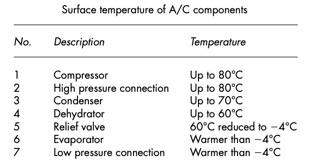  

### Проверка по показаниям манометров  
Показания манометров, приведённые в этом разделе, указывают на возможные значения давления, соответствующие различным неисправностям, которые часто встречаются в системах кондиционирования воздуха. Полученные показания могут различаться в зависимости от следующих факторов:  
1. Хладагент, используемый в системе: R12, R134a.  
2. Тип системы регулирования — FOV, TXV, EPR.  
3. Тип компрессора — с фиксированной или переменной производительностью.  
4. Сочетание перечисленных выше факторов.  

Сторона низкого давления системы показывает количество хладагента, дозируемого в испаритель, проходящего через него и возвращающегося обратно в компрессор. Ниже приведены примеры значений давления низкой стороны для некоторых распространённых типов систем:  
1. Система с фиксированным дросселем (FOV, CCOT).  
Давление низкой стороны находится в определённом диапазоне между нижней и верхней точками регулирования, в пределах которого работает циклический выключатель. Например: 1,5–2,9 бар.  

2. Система с расширительным клапаном регулирует поток хладагента путём дросселирования. В нормальном состоянии давление в системе обычно составляет около 2 бар. В системе с термостатическим расширительным клапаном давление может опускаться до 0,7 бар.  

3. EPR (Evaporator Pressure Regulator — регулятор давления испарителя).  
EPR обычно поддерживает работу системы около заданного значения давления. Например, клапан EPR Toyota поддерживает давление около 2 бар.  

4. Компрессоры с переменной производительностью.  
Как правило, они регулируют давление на стороне низкого давления примерно до 2 бар.  
Сторона высокого давления системы имеет более широкий диапазон значений давления и отражает тепловую нагрузку на систему.  
Давление на стороне высокого давления показывает количество тепла, которое необходимо отвести через конденсер.  
Температура и влажность окружающего воздуха играют важную роль в определении значения давления на стороне высокого давления.  

#### Тестирование системы CCOT  
Для диагностики неисправностей системы FOV с переключателем циклического включения/выключения по низкому давлению используются три основных параметра:
давление на стороне низкого давления;  
давление на стороне высокого давления;  
циклы включения и выключения компрессора.  

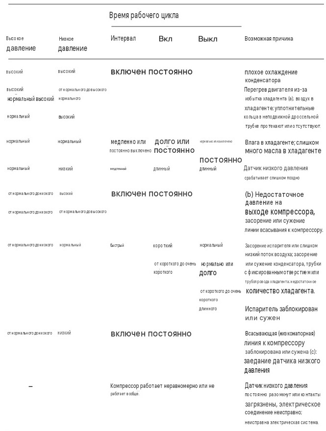

Для проведения точного испытания необходимо выполнить следующие требования:  
1. Закрыть оба ручных клапана на манометрах. Подсоедините манометры к стороне высокого и низкого давления системы кондиционирования воздуха.  
2. Запустить двигатель.  
3. Установите кондиционер на максимальное охлаждение.  
4. Включить рециркуляцию воздуха.  
5. Установите вентилятор на максимальную скорость.  
6. Запустить двигатель на 1500 об/мин.  
7. Двигатель должен работать при нормальной рабочей температуре.  
8. Все окна должны быть закрыты.  
9. Все вентиляционные отверстия должны быть закрыты, кроме центрального вентиляционного отверстия.  
10. Вентиляционные отверстия должны быть переключены в положение «в лицо».  
Измеренные значения (R134a) для высокого и низкого давления зависят от температуры наружного воздуха. Это показано на на диаграммах ниже. Площадь между двумя кривыми соответствует диапазону допуска. Измеренное значение должно находиться в этом диапазоне.

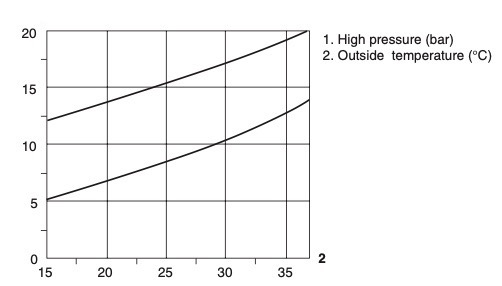  

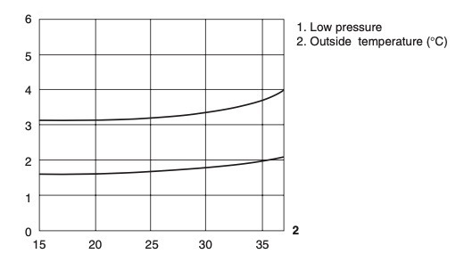  

Двигатель выключен (статическое давление)  
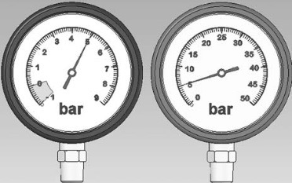  
*Нормальное давление на стороне низкого давления, нормальное давление на стороне высокого давления*  

Двигатель работает (динамический тест)  
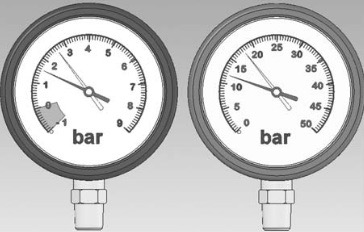  
*Низкое давление – нормальное, высокое давление – нормальное*  

Схема поиска неисправностей терморегулирующего клапана  
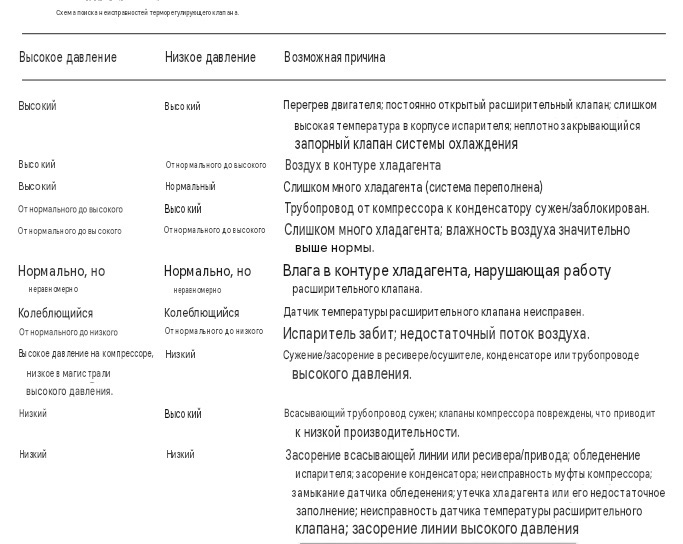

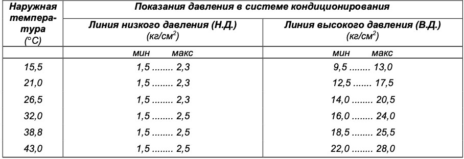  
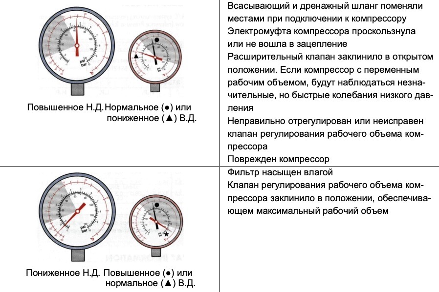  
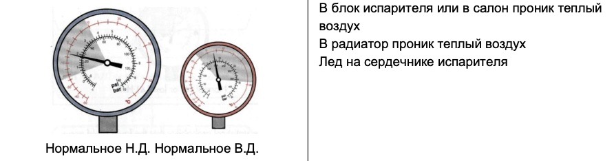  
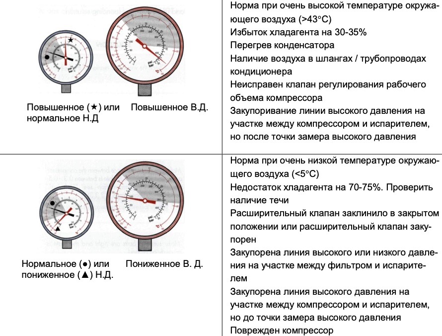  
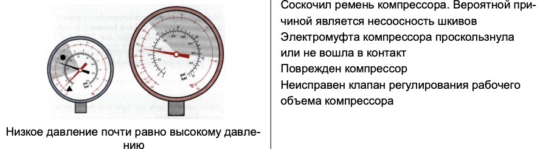  

### Возможные неисправности, их причины и методы устранения
Кондиционер шумно работает  

|  | Причина / неисправность | Решение |
|---|---|---|
| 1 | Ремень изношен или соскользнул | Проверьте износ и натяжение ремня |
| 2 | Шумно работает натяжной шкив | Замените натяжной шкив |
| 3 | Проскользнул диск электромуфты | Обеспечьте расстояние между шкивом компрессора и диском электромуфты 0,3–0,5 мм |
| 4 | Вибрация и резонанс опорного диска компрессора | Проверьте момент затяжки болтов и правильность положения диска. Проверьте соосность шкивов |
| 5 | Расширительный клапан «свистит» | При постоянном шуме замените испаритель в сборе |
| 6 | Неправильный слив конденсата | Если вентилятор отопителя работает на всасывание, установите отсекающий клапан на наружном конце шланга слива конденсата, чтобы конденсат выводился наружу и не закачивался обратно, издавая булькающий шум |  

Неправильный объем хладагента  
Воздух, неконденсирующиеся газы или влага в кондиционере  

|  | Причина / неисправность | Решение |
|---|---|---|
| 1 | Неправильный объем хладагента (на 30–35% больше или на 70–75% меньше). Примечание: не требуется замена фильтра кондиционера | Удалите хладагент из кондиционера. Откачайте неконденсирующиеся газы и влагу из кондиционера, включив вакуумный насос как минимум на 15 минут. Проверьте герметичность системы при помощи манометра. Заправьте систему рекомендуемым объемом хладагента, а также маслом, удаленным из системы вместе с хладагентом |
| 2 | Расширительный клапан заклинило в закрытом положении / Расширительный клапан закупорен | Замените испаритель в сборе. Откачайте неконденсирующиеся газы и влагу из кондиционера, включив вакуумный насос как минимум на 15 минут. Заправьте систему рекомендуемым объемом хладагента, а также маслом, удаленным из системы вместе с хладагентом |
| 3 | Неисправен клапан регулирования рабочего объема компрессора | Удалите хладагент из кондиционера. Замените компрессор. Откачайте неконденсирующиеся газы и влагу из кондиционера, включив вакуумный насос как минимум на 15 минут. Заправьте систему рекомендуемым объемом хладагента, а также маслом, удаленным из системы вместе с хладагентом |
| 4 | Закупорен контур кондиционера | Определите место закупоривания, выявив в контуре участок с резким перепадом температур (высокая температура выше места закупоривания, низкая температура ниже места закупоривания). Удалите хладагент из кондиционера. Замените закупоренный компонент. Тщательно промойте кондиционер, используя специальное средство, и замените осушающий фильтр во избежание оседания в контуре осадка грязи, образовавшегося в результате закупоривания. Откачайте неконденсирующиеся газы и влагу из кондиционера, включив вакуумный насос как минимум на 15 минут. Заправьте систему рекомендуемым объемом хладагента, а также маслом, удаленным из системы вместе с хладагентом |
| 5 | Фильтр насыщен влагой | Удалите хладагент из кондиционера. Замените фильтр кондиционера. Откачайте неконденсирующиеся газы и влагу из кондиционера, включив вакуумный насос как минимум на 15 минут. Проверьте герметичность системы при помощи манометра. Заправьте систему рекомендуемым объемом хладагента, а также маслом, удаленным из системы вместе с хладагентом |  

Кондиционер выделяет неприятный запах  

| Причина / неисправность | Решение |
|---|---|
| В определенных условиях на поверхности испарителя возможно образование плесени и бактерий (как правило, содержащихся в воздухе), которые становятся причиной неприятного запаха. Иногда запах возникает из-за закупоривания шланга слива конденсата | Используйте антибактериальное средство для обработки испарителя, прочистите шланг слива конденсата. Посоветуйте клиенту выключить кондиционер за несколько минут до выключения двигателя автомобиля, оставив нагнетательный вентилятор включенным (это позволит высушить сердечник испарителя от влаги, которая способствует росту бактерий) |  

Конденсатор не рассеивает тепло в достаточном объеме  

|  | Причина / неисправность | Решение |
|---|---|---|
| 1 | Воздуховод закупорен грязью, скопившейся на теплообменниках: водяном радиаторе, конденсаторе (вероятно после 25 000–30 000 км пробега) | Тщательно очистите радиатор и конденсатор |
| 2 | Реле давления или термочувствительный элемент не отключаются по достижении заданного уровня давления и температуры | Отключите блоки управления посредством соответствующего электрического контакта. При необходимости замените неисправный компонент |
| 3 | Не работает электрический вентилятор | Подключите электрический вентилятор напрямую. Если вентилятор по-прежнему не работает, его необходимо заменить |
| 4 | Неправильно работает электрический вентилятор (неправильное направление вращения) | Вентилятор работает на всасывание, если он находится между теплообменниками и двигателем, и на выдув, если он находится между теплообменниками и впускным отверстием наружного воздуха |
| 5 | Перегрев воды в системе охлаждения двигателя | Проверьте исправность оригинальной системы водяного охлаждения двигателя |
| 6 | Неправильно расположен конденсатор | Убедитесь, что расстояние между радиатором и конденсатором составляет 15–20 мм; если расстояние соблюдено, проверьте правильность расположения воздуховодов |  

Электромуфта компрессора проскальзывает или не входит в зацепление  

|  | Причина / неисправность | Решение |
|---|---|---|
| 1 | Недостаточное количество хладагента (на 70–75% меньше) | Найдите утечку хладагента. Удалите хладагент из кондиционера. Откачайте неконденсирующиеся газы и влагу из кондиционера, включив вакуумный насос как минимум на 15 минут. Проверьте герметичность системы при помощи манометра. Заправьте систему рекомендуемым объемом хладагента, а также маслом, удаленным из системы вместе с хладагентом |
| 2 | Контур электромуфты обесточен / Подача питания на контур неустойчивая | Отсоедините провод электромуфты от контура и подключите к клемме «+» аккумулятора посредством плавкого предохранителя 7,5 А. Замените компрессор в сборе. Если электромуфта входит в зацепление, проверьте реле давления, термостат, управляющий переключатель кондиционера и электрические контакты |
| 3 | Неправильное расстояние между шкивом компрессора и диском электромуфты | Расстояние должно составлять 0,3–0,5 мм |  

Лед на трубках испарителя  

|  | Причина / неисправность | Решение |
|---|---|---|
| 1 | Неисправная работа нагнетательного вентилятора | Включенный кондиционер должен обеспечивать работу вентилятора, по меньшей мере, на первой скорости. В противном случае проверьте правильность подключения электрооборудования |
| 2 | Неисправен клапан регулирования рабочего объема компрессора | Замените компрессор |  

Поврежден компрессор  

|  | Причина / неисправность | Решение |
|---|---|---|
| 1 | Погнуты клапаны, заклинивание. *(Примечание: нет необходимости промывать систему)* | Удалите хладагент из кондиционера. Снимите компрессор. Если компрессор заклинило, промойте кондиционер, используя специальное средство, и замените осушающий фильтр во избежание оседания в контуре осадка грязи, образовавшегося в результате закупоривания. Установите новый компрессор. Откачайте неконденсирующиеся газы и влагу из кондиционера, включив вакуумный насос как минимум на 15 минут. Проверьте герметичность системы при помощи манометра. Заправьте систему рекомендуемым объемом хладагента, а также маслом, удаленным из системы вместе с хладагентом. |  

В салон поступает горячий воздух  

|  | Причина / неисправность | Решение |
|---|---|---|
| 1 | Водяной клапан радиатора отопителя (при его наличии) не закрывается должным образом | Проверьте рычажные механизмы и/или электродвигатель клапана. Отключите радиатор при необходимости |
| 2 | Нарушена герметичность заслонок смешения воздуха и/или рециркуляции воздуха | Проверьте рычажные механизмы и/или электродвигатель клапана |
| 3 | Нарушена герметичность изоляции испарителя | Убедитесь, что испаритель герметичен и соединен с оригинальным радиатором должным образом, предотвращающим проникновение теплого воздуха извне |