### Защитные элементы цепей. Предохранители

Распространённый способ защиты от возгорания проводов при коротких замыканиях – применение плавких предохранителей.  
Кроме них в практике мирового автомобилестроения применяются термопредохранители, разрывные линии и т.д.

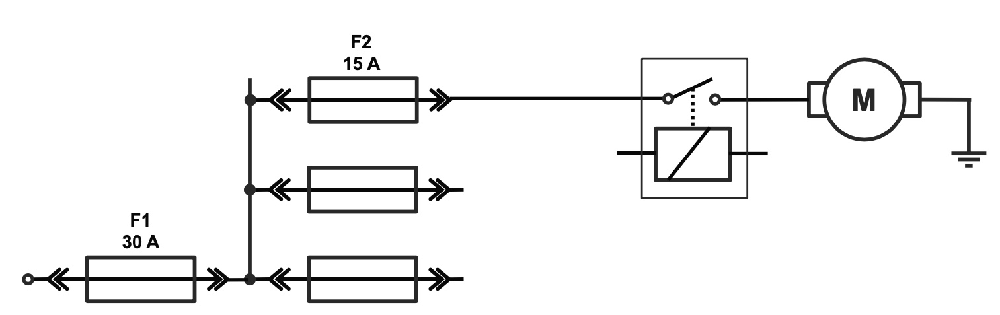
*Предохранители устанавливаются в разрыв плюсового токоведущего провода.  
Как правило установка предохранителей производится максимально близко к источнику напряжения или к узлу разветвления, чтобы защитить большую часть проводной линии.  
На схемах чаще всего предохранитель обозначают «F» от английского слова Fuse – плавка/плавкий, реже на некоторых схемах он обозначен «S» от немецкого Sicherung – защита.*

### Cвойства предохранителей
!!! info inline ""

    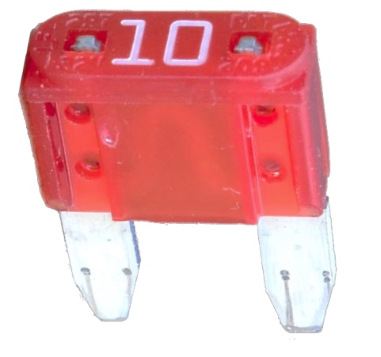{ align=left } 
Предлагается исследовать свойства и параметры предохранителей, на примере ножевого (флажкового) предохранителя типоразмера «MINI» , номиналом 10 Ампер.

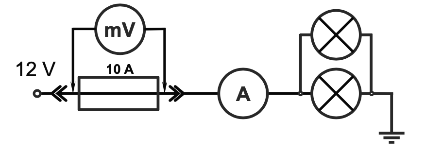
*Чтобы понять как работает предохранитель, предлагается произвести измерения в схеме, показанной на рисунке.  
Предохранитель используется номиналом 10 Ампер. Типоразмер предохранителя – «MINI». Две лампы накаливания подобраны таким образом, что суммарный ток потребления составляет 10 Ампер, т.е. предохранитель работает с максимальным рабочим током.  
Произведём измерение падения напряжения на предохранителе.*

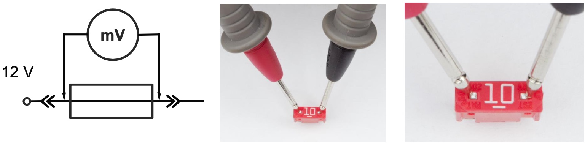
*Примечание: Для измерения падения напряжения на предохранителе удобно подключение щупов, так, как это показано на фото. Такой способ позволяет измерять падение напряжение на установленных в гнезда предохранителях прямо в монтажном блоке. Следует помнить, что падение напряжения на предохранителях измеряется в милливольтовом диапазоне, т.е. в тысячных долях Вольта, поэтому на рабочем месте диагноста должен быть мультиметр работающий в этом диапазоне.*

!!! info inline ""

    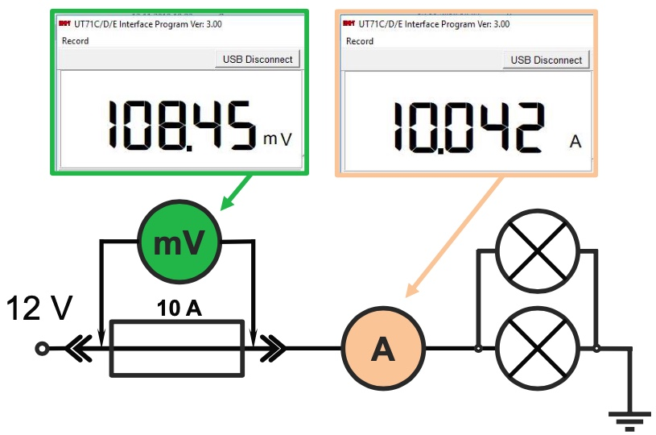{ align=left } 
Измерения показывают, что при максимальном рабочем токе падение напряжения на предохранителе составляет 108.45 милливольта.  

Электрическая мощность, выделяемая на предохранителе, составляет: P=IхU → P=10.042 х 0.10845 ≈ 1.09 [Вт].  

Выделяемая мощность выражается в тепловыделении (предохранитель нагревается). Но выделяемой мощности недостаточно для расплавления плавкой перемычки. Если ток через предохранитель увеличится, то соответственно, возрастёт и падение напряжения на нём, и увеличится выделяемая мощность, появятся температурные условия для расплавления перемычки.

!!! info inline ""

    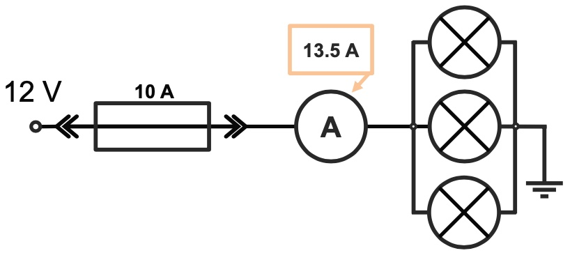{ align=left } 
Требования к плавким предохранителям, применяемым в автомобилях, отражены в ИСО 8820–1:2014 и других документах. Если кратко, то предохранитель «MINI» при прохождении через него тока через него в 1.35 раза больше номинального должен перегореть в диапазоне времени от 0.75 до 1800 секунд.  

Если в схеме с предохранителем на 10 А увеличить ток потребления до 13.5 А, то предохранитель не сгорит мгновенно. Как правило, несколько секунд он выдерживает повышенный ток, разогреваясь до точки плавления. Время расплавления также зависит от температуры окружающей среды. Если в автомобиле периодически сгорает предохранитель, это не обязательно короткое замыкание, возможно, это циклическое повышение максимального тока в 1- 1.5 раз.

!!! info inline ""

    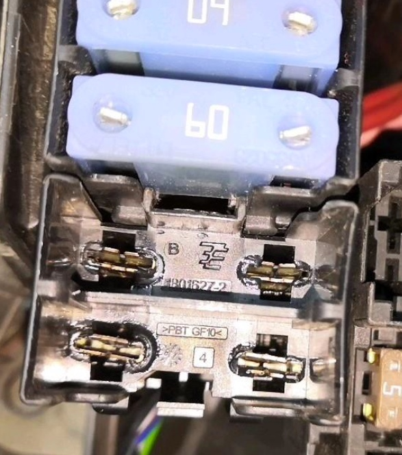{ align=left } 
В зависимости от вида предохранителей при токе, превышающем номинал в 1.35 раза, предохранитель может сработать в диапазоне времени от 0.75 до 3600 секунд.  
Поэтому при наличии признаков повышенного тока (оплавление), но целом предохранителе следует измерить в этой цепи ток. Потому что, если ток выше номинала предохранителя, а поездки на автомобиле коротки – то может сложится ситуация, когда ток завышен, а предохранитель не успевает сгореть.  

Причины повышения тока сверх нормативного рассмотрены в материалах об измерении силы тока. Очень часто – это механическое подклинивание электромоторов.

!!! info inline ""

    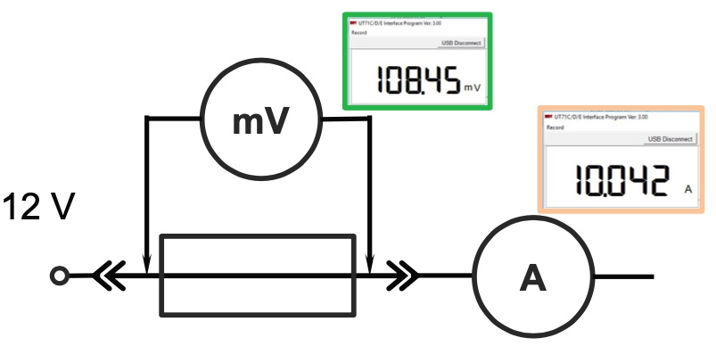{ align=left } 
Если при прохождении электрического тока через предохранитель на нём можно измерить падение напряжения, то можно рассчитать и его сопротивление.  

Согласно закона Ома: Rпред= 0.10845 / 10.042 = 0.0108 [Ом]  

Предохранитель проявляет себя как элемент с очень малым, но отличным от нуля сопротивлением. Если сопротивление предохранителя уменьшить в несколько раз, то он практически потеряет свойство сгорать, поскольку выделяемая мощность уменьшится с уменьшением падения напряжения. Сопротивление предохранителя – жёстко нормируемая величина при его производстве, что бы он сгорал при определённом токе.

!!! info inline ""

    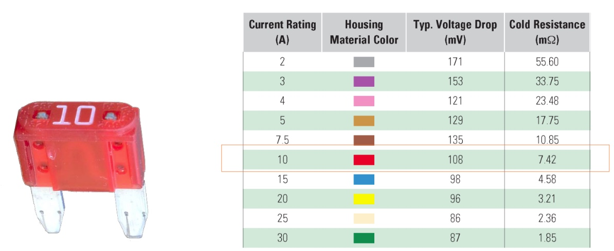{ align=left } 
Нормированное сопротивление предохранителей публикуется производителями. Кроме того, указывается максимальное падение напряжения при номинальном токе.  

Падение напряжения из примера выше (108.45 mV) для предохранителя 10А совпадает с табличным, а по сопротивлению есть разница 10.8 mΩ против табличного значения 7.42 mΩ . Но ошибки в расчётах нет, просто в таблице указано сопротивление холодного предохранителя. А с прогревом сопротивление металлов растёт. (PTC – Positive Temperature Coefficient).

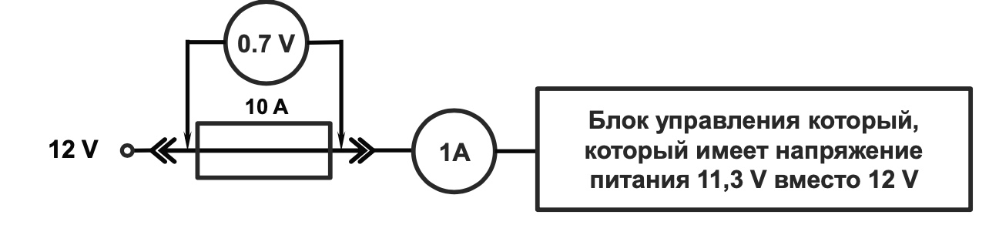
*Кроме заниженного сопротивления контрафактного предохранителя, который не сможет защитить цепи, вовремя расплавившись, известна другая проблема – его повышенное сопротивление.  
Это опасно тем, что устройство запитанное через этот предохранитель, получает заниженное напряжение. Причём такой предохранитель с завышенным сопротивлением теоретически должен и перегореть при меньшем токе. Но если реальный ток, потребляемый устройством, в несколько раз меньше номинала предохранителя, то такой предохранитель не сгорит, а будет «отнимать» напряжение питания у устройства. Очень опасны такие предохранители для блоков управления, ток потребления которых изменяется в зависимости от режима работы - например КСУД. В известном случае автомобиль с таким предохранителем не развивал мощность. Выявить такую неисправность тяжело.*

!!! info inline ""

    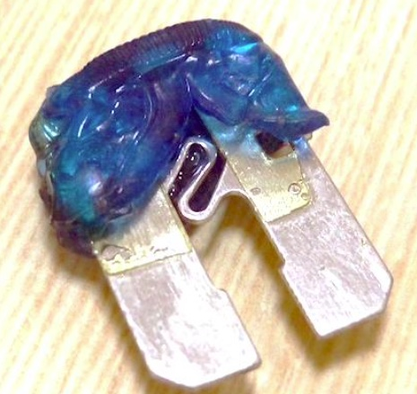{ align=left } 
Кроме «неправильного» сопротивления перемычки существует ещё один вариант неисправности от некачественного предохранителя. 

Это пример «несгорающего» контрафактного предохранителя. Наиболее вероятно, что перемычка сделана из материала, который не способен расплавляться при выделяемой мощности на этой перемычке.  

Материал перемычки в оригинальном варианте – сплав на основе цинка. Для прецизионных предохранителей и предохранителей работающих при повышенных температурах – сплав с использованием серебра.

### Виды предохранителей
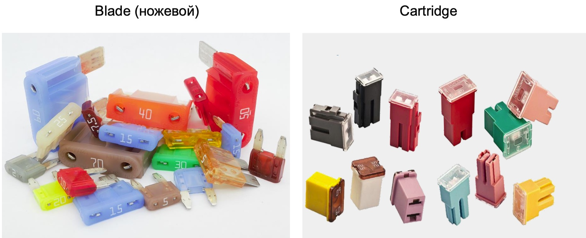
*Предохранители ножевого типа были созданы и использовались в автомобилях намного раньше предохранителей картриджного типа. У предохранителей картриджного типа диапазон времени срабатывания меньше, т.е они демонстрируют большую предсказуемость по защите от высоких токов. Но предохранители картриджного типа менее распространены и дороже.  
Оба вышеперечисленных вида предохранителей реализуются в нескольких типоразмерах.*

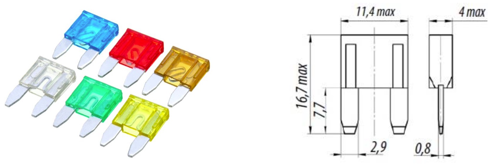
*Предохранители типоразмера «MINI» одни из самых распространённых в современных автомобилях. Разработка 1993 г.
Предохранитель «MINI» должен сработать при токе, превышающем номинал в 1,35 раз в диапазоне 0.75 до 1800 секунд. При токе, вдвое превышающем номинал, в диапазоне 0.15 до 5 секунд.*

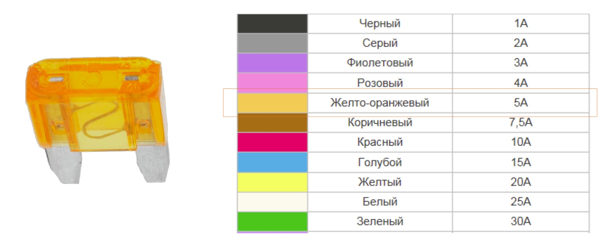
*Цветовая маркировка предохранителей типоразмера «MINI».*

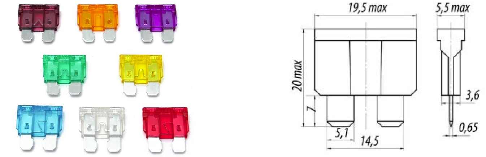
*Плоские предохранители стандарт (АТО). Разработка 1970 г. Как правило, такими предохранителями защищают цепи, рассчитанные на средние токи 5-30 Ампер.  
Предохранитель АТО должен сработать при токе, превышающем номинал в 1,35 раз в диапазоне времени 0.7 до 600 секунд. При токе, вдвое превышающем номинал, в диапазоне 0.15 до 5 секунд.*

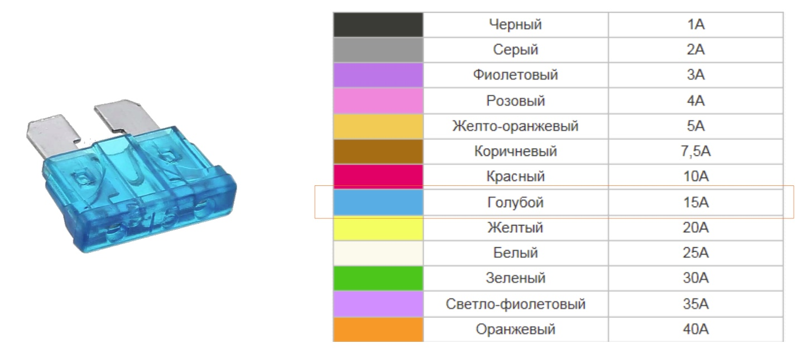
*Цветовая маркировка предохранителей ATO.*

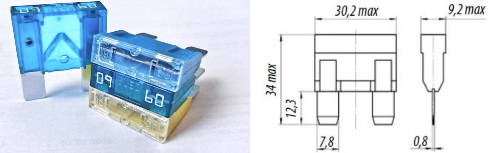
*Плоские предохранители «MAXI». Как правило, такими предохранителями защищают цепи, рассчитанные на большие токи: 40-70 Ампер.  
Предохранитель «MAXI» должен сработать при токе превышающем номинал в 1,35 раз в диапазоне времени 60 до 3600 секунд. При токе, вдвое превышающем номинал, в диапазоне 2 до 60 секунд. Т.е. в сравнительном плане эти предохранители более инерционны.*

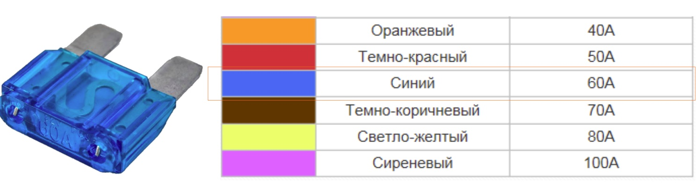
*Цветовая маркировка предохранителей «MAXI».*

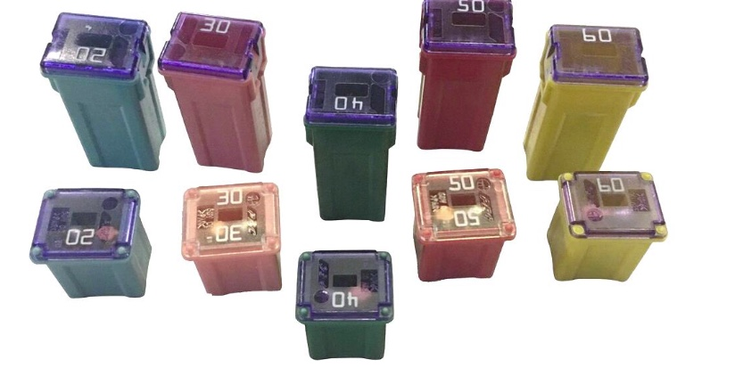
*Среди картриджных предохранителей выделяют несколько разновидностей. Базовым вариантом является тип JCASE. Такжне есть предохранители Low Profile JCASE – это версия с меньшей высотой корпуса.*

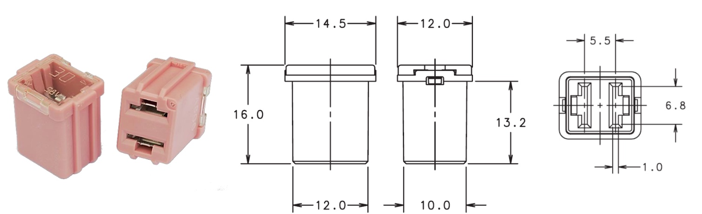
*Предохранители Low Profile JCASE, как правило, используются для защиты цепей с более высоким током потребления в сравнении с предохранителями «MAXI», имеют меньший разброс времени срабатывания (при токе 1.35 от номинального – от 60 до 1800 секунд), что делает их более предсказуемыми. При токе вдвое больше номинального время срабатывания – от 4 до 60 секунд.*

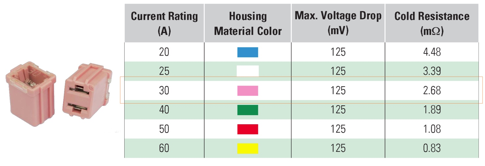
*Предохранители Low Profile JCASE имеют цветовую маркировку, отличную от ножевых предохранителей. В таблице указаны также сопротивление и предельное падение напряжения.*

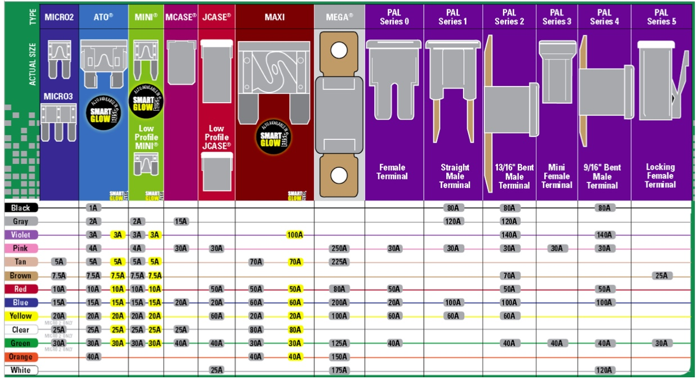
- Black – чёрный  
- Gray – серый  
- Violet – фиолетовый  
- Pink – розовый  
- Tan – загар (жёлто-коричневый)  
- Brown – коричневый  
- Red – красный  
- Blue – синий  
- Yellow – жёлтый  
- Clear – прозрачный  
- Green – зелёный  
- Orange – оранжевый  
- White – белый

!!! info inline ""

    { align=left } 
На рынке предохранителей есть серия SMART GLOW. В случае разрыва вставки в корпусе этого предохранителя начинает светится светодиод. Это удобно, например, для предохранителей на прикуриватель. 

 

### Поиск тока утечки

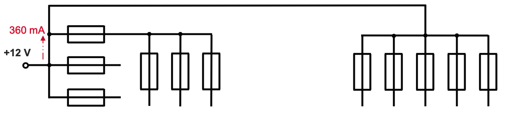
Автомобиль имеет неисправность в виде повышенного ток утечки (360 mA). Требуется определить, какое устройство потребляет этот ток.  

Провода большого сечения и открытого монтажа можно охватить токовыми клещами и измерить ток. Как правило, это провода на генератор, стартер, ЭГУР или провода от крупных предохранителей, которые можно видеть в нижней части монтажного блока. Но обычно в этих направлениях повышенного тока покоя нет.  

Разобрать жгут идущий, к монтажному блоку внутри салона, крайне трудоёмко. Демонтировать поочередно предохранители для оценки тока через них бессмысленно т.к. во время разрыва цепи и с последующим её восстановлением произойдёт перезагрузка блока управления, который подключен через этот предохранитель. И снова нужно будет выжидать время «засыпания» автомобиля.

!!! info inline ""

    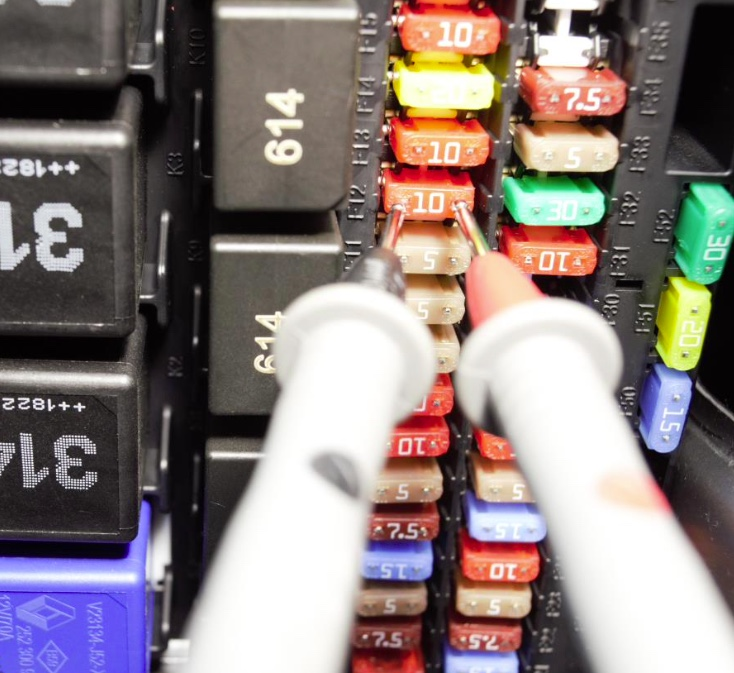{ align=left } 
Существует инженерный прием, позволяющий определить, через какой предохранитель протекает ток утечки.  
Поскольку предохранитель имеет сопротивление, хоть и очень малое, то, если по нему протекает ток, на нём будет падение напряжения. Если ток через предохранитель равен нулю, то и падение напряжения на предохранителе равно нулю. С учётом очень малого сопротивления предохранителей , падение напряжения на них измеряется в милливольтах (mV). Для такого измерения нужен мультиметр, работающий в этом диапазоне. В процессе поиска можно найти несколько предохранителей, на которых есть падение напряжения.

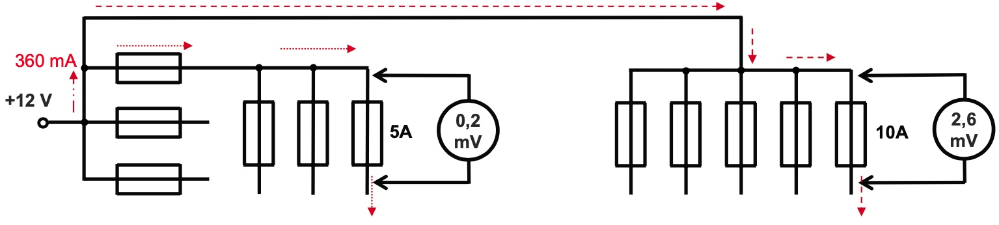
Допустим, что обнаружено два предохранителя, на которых есть падение напряжения, отличное от нуля, т.е. через них протекает ток. Но ток через один из них может быть нормативным (менее 20mA). Как узнать, через какой предохранитель протекает ток, вызывающий превышение тока утечки?

!!! info inline ""

    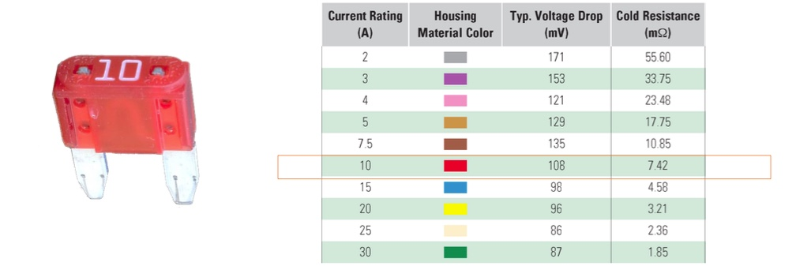{ align=left } 
Можно воспользоваться таблицей с указанием сопротивления предохранителей и рассчитать ток через предохранитель при определённом падении напряжения на нём.  

Как правило, искомые токи утечки имеют диапазон до 1 Ампера, поэтому увеличением сопротивления предохранителя от нагрева при протекании тока, можно пренебречь.  

Например, на предохранителе «мини» номиналом 10 А при падении напряжения на нём в 2.6 mV через него протекает ток I=U / R → I=0.0026 / 0.00742 ≈ 0.35 [A] или это 350 mA.  

Аналогично выясняем, что на предохранителе 5А мини падение напряжения в 0.2 mV соответствует току через него около 11 mA.

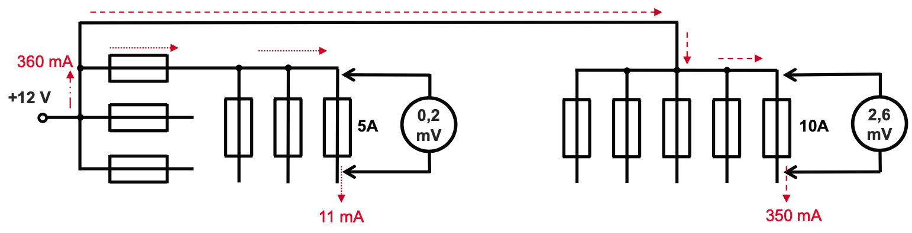
Очевидно, что ток 350 mA и есть искомый повышенный ток, а ток в 11 mA наиболее вероятно допустимый ток питания какого-то блока с элементами памяти.  

Если в процессе поиска тока утечки, замеряется падение напряжения на 2.6 mV на предохранителе 10А «мини» – это означает, что через этот предохранитель протекает ток около 350 mA. Остаётся определить по схеме, что подключено к этому предохранителю и внимательно проверить эту линию / блок управления.  

Следует понимать, что ток утечки может складываться из нескольких токов, например, если неисправный электронный блок «разбудил» другой блок. В этой ситуации найдётся несколько предохранителей с падением напряжения отличным от нуля.

!!! info inline ""

    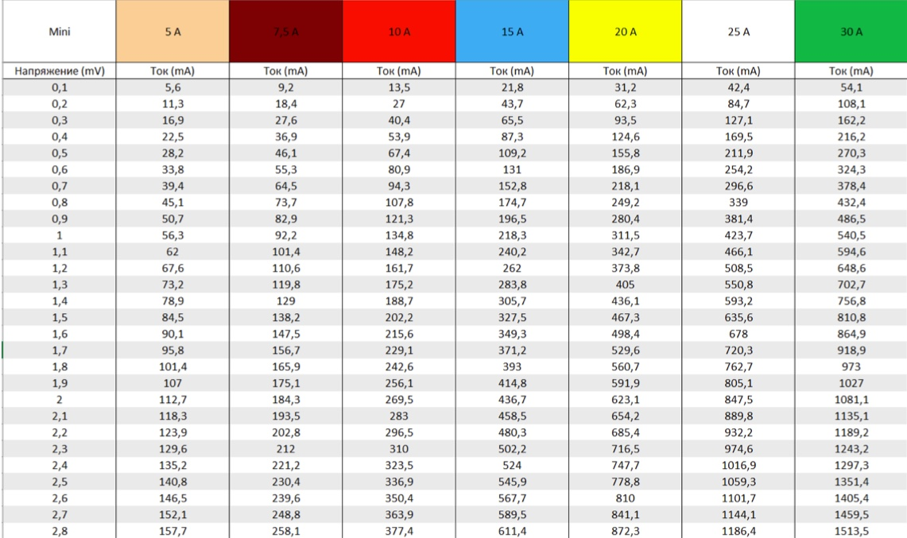{ align=left } 
Для работы удобно иметь таблицы Excel для различных предохранителей. Следует учитывать, что высокой точности совпадений измерений и расчёта быть не может, поскольку всегда присутствует технологический разброс как самих предохранителей, так и точность средств измерения. Но даже точности в 10 % вполне достаточно для поиска линии по которой протекает повышенный ток утечки.  

!!! info inline ""

    { align=left } 
Таблица для предохранителей АТО.  
Аналогичные таблицы составляются и для других типов предохранителей.