### Электрическое напряжение

Значительное количество дефектов электрооборудования происходит вследствие занижения напряжения питания или искажения сигнала на линиях передачи аналогового сигнала.

*Простейший случай демонстрации дефекта, требующего замера напряжения – заниженная яркость головного света по левой стороне.*

Электрическое напряжение - разность потенциалов двух точек электрического поля.  
Обозначение электрического напряжения – U  
Единица измерения – В (Вольт)  

!!! info inline ""

    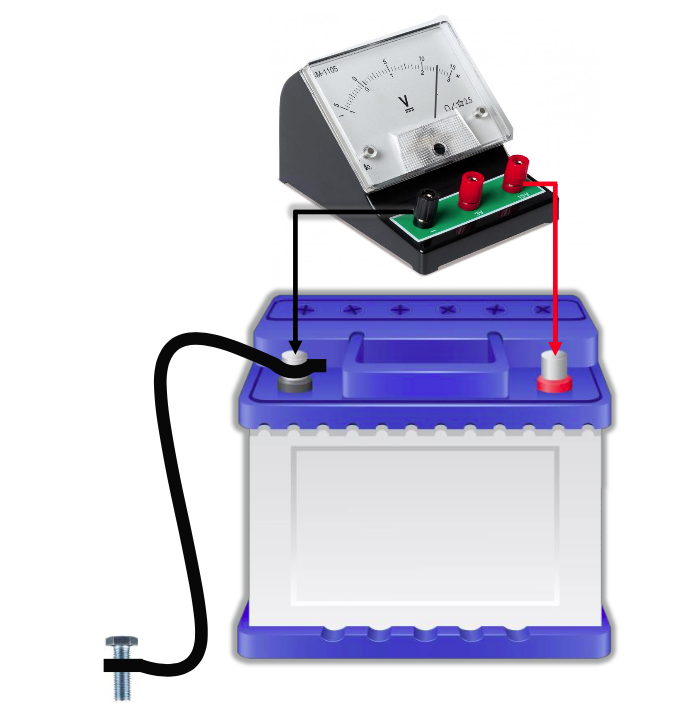{ align=left } 

В автомобиле один из полюсов АКБ , соединен с кузовом и приравнен к нулю (масса). Удобно вести отсчет потенциала именно от нулевого уровня.  
Потенциал плюсового вывода АКБ 12 Вольт, соответственно напряжение на выводах АКБ составляет 12 Вольт – 0Вольт = 12 Вольт.  

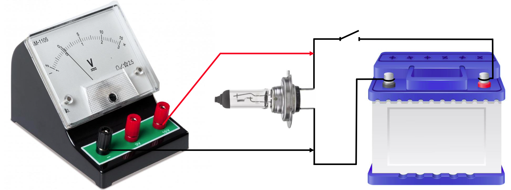
*Прибор для измерения напряжения называется Вольтметр. Подключается параллельно объекту на котором измеряем напряжение.*

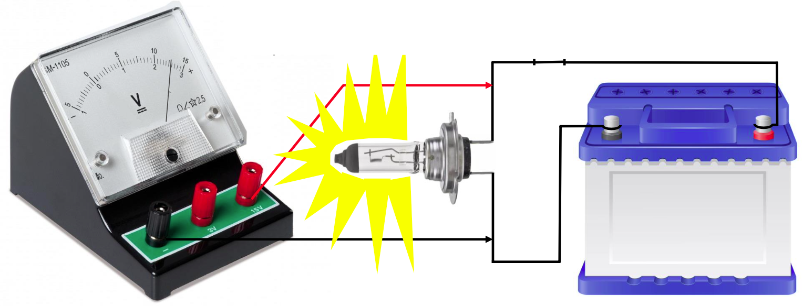
*Замер производится исключительно под нагрузкой (цепь замкнута).  
Вольтметр – прибор с очень большим внутренним сопротивлением. Фактически это означает, что при его подключении не происходит увеличения тока потребляемого схемой и он не может явиться причиной неисправности.*

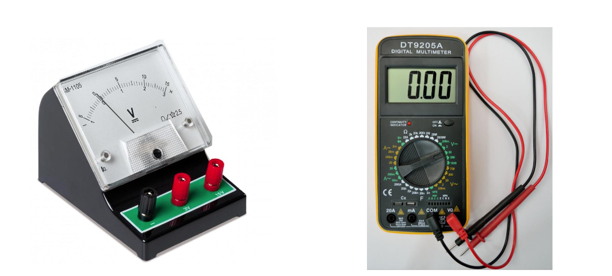
*В настоящий момент классические вольтметры в обиходе практически вытеснены мультиметрами.  
Мультиметр – прибор для измерения нескольких физических величин. Очень удобен для диагностических работ на автомобиле, в зависимости от модификации имеет дополнительные функции, например фиксирование минимальных и максимальны значений измеряемой величины, удержание измеренной величины и т.д.*

!!! info inline ""

    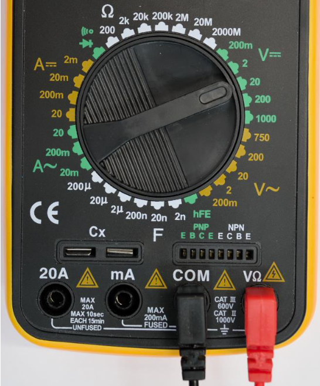{ align=left } 

Поскольку мультиметр «совмещает» несколько измерительных приборов, то в зависимости от типа измеряемой величины необходимо задействовать строго определённые измерительные входы. Т.е. необходимо корректное расположение щупов. В режиме вольтметра мультиметр как и положено имеет высокое входное сопротивление, а в режиме амперметра входное сопротивление близко к нулю.
Типовой негативный опыт – когда в рем. зоне мультиметр используется несколькими сотрудниками и оставлен последним использующим в режиме амперметра. Следующий пользователь решил измерить напряжение ,но не переставил щупы в соответствующие гнезда и в момент измерения происходит короткое замыкание. В лучшем случае сгорает предохранитель в мультиметре в худшем выгорает сам измерительный прибор или компонент электрической схемы.

Кроме корректного расположения щупов, необходимо корректное определение диапазона измерения и типа измеряемого напряжения/тока.
Например, на мультиметре активен режим измерения напряжения до 20 Вольт. Если в таком режиме произвести замер напряжения более чем 20 Вольт, то прибор не пострадает, но индикации измерения не будет. Но в аналогичной ситуации при измерении силы тока, прибор может пострадать, поэтому корректный выбор диапазона важен.  
В настоящий момент на многих автомобилях не используются напряжения свыше 16,5 Вольт, поэтому выбор диапазона 20 Вольт вполне достаточен. Кроме диапазона выбирается тип измеряемого напряжения:

Практически все измерения проводятся в режиме постоянного / медленно меняющегося тока

!!! info inline ""

    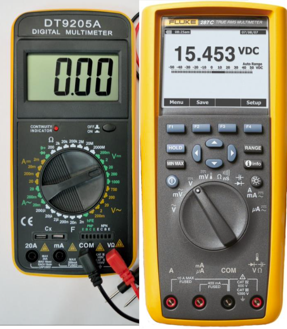{ align=left } 

Кроме мультиметров с ручным выбором диапазона, применяются мультиметры с автоматическим выбором диапазона. В работе такие мультиметры удобнее, но как правило они находятся в более высокой ценовой категории.  

Кроме того следует учесть, что при использовании такого мультиметра приходится обращать внимание на размерность измеряемой величины. Например при разрушении плюсового питающего провода или при обгорании контактов переключателя, может так совпасть, что измеренное напряжение составляет 12 mV (милливольт). Т.е. это 0.012 Вольт.  

А при беглом взгляде на табло может показаться, что там желаемые 12 Вольт.  
Во избежание таких ситуаций, мультиметры с автоматическим выбором диапазона сохраняют возможность перехода на ручной выбор.

### Неисправность, требующая измерения напряжения

Вернемся к неисправности, которая рассматривалась в водной части.  
Для локализации неисправности недостаточной яркости фары слева обратимся к электросхеме. Произведём замер напряжения на лампе в левой фары.  

!!! info inline ""

    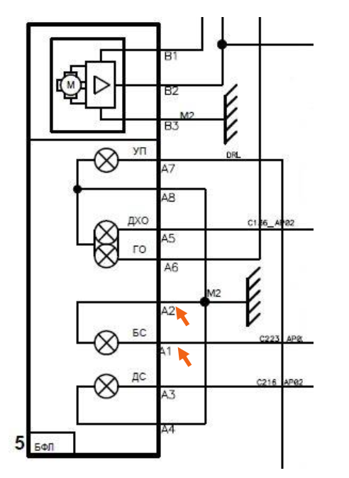{ align=left } 

Используем электросхему, определяем точки замера напряжения.

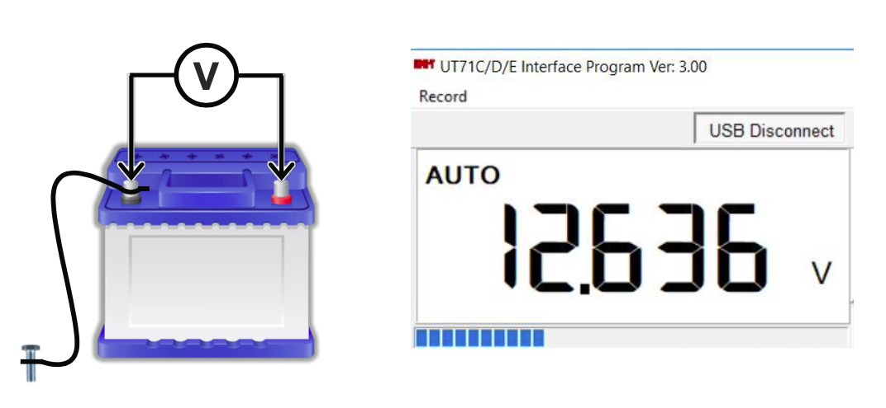
*При любой неисправности электрооборудования, поиск неисправности начинается с проверки напряжения АКБ. В данном случае близко к полностью заряженному (12.75 V). Менее 12.5 V однозначно – зарядное устройство.*

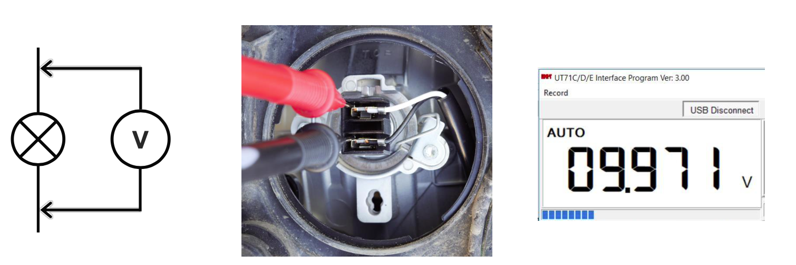
*Производим замер напряжения на лампе ближнего света. Проверка производится под нагрузкой (лампа включена), вольтметр параллельно нагрузке. Замер легко произвести, поскольку доступ до токоведущих контактов разъёма лампы возможен сразу после удаления колпака фары. Результаты указывают на наличие неисправности - 10 Вольт достаточно для накала лампы, но не достаточно для её нормативной яркости свечения.*

### Измерение напряжения в контрольных точках относительно «массы»

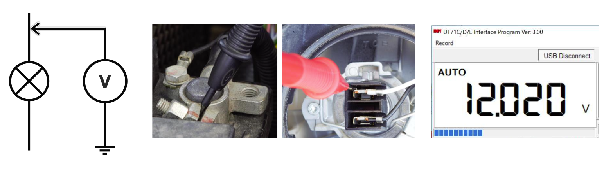
*Из исходного напряжения питания 12.63 V на лампе менее 10 V.  
Чтобы определить, где потеряно более 2.5 V, необходимо измерить напряжение (потенциалы) на выводах лампы по отношению к нулевому потенциалу (масса).  
Результат замера по плюсовому проводу 12 V (изображение) т.е. потери составляют около 0.6 V. Этими потерями можно пренебречь, понимая, что они обусловлены потерей на контактах переключателя.*

### Измерение напряжения в контрольных точках относительно «массы»

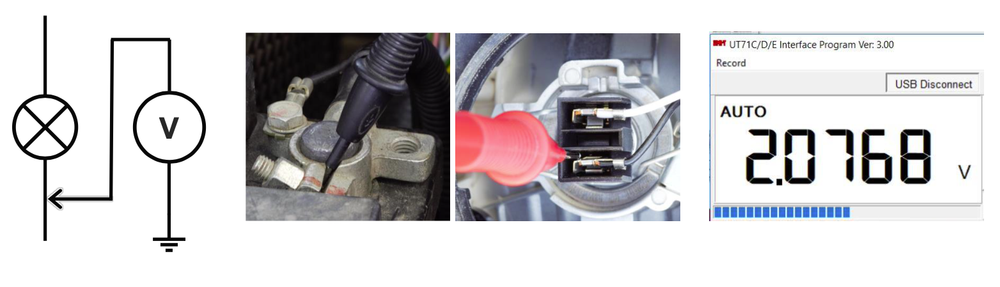
*Оценим потенциал другого вывода лампы по отношению к массе. Результат замера 2.1 V*

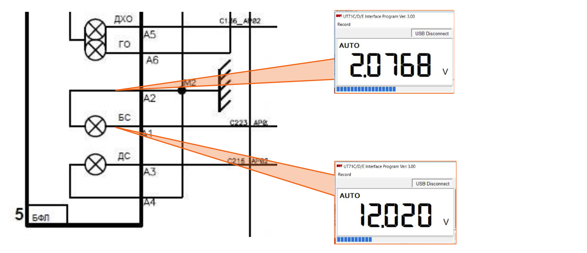
*Расставим измеренные значения потенциалов на схеме. Дефект очевиден. На массовом проводе по отношении к той же массе должно быть около 0 Вольт. Однако по факту около 2 Вольт.*

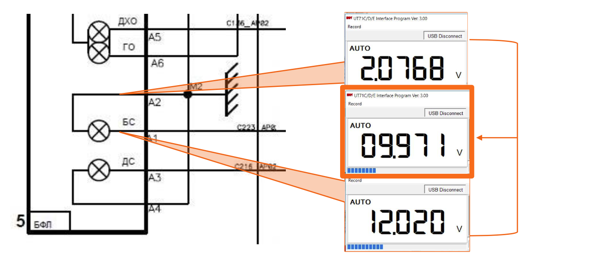
*Именно разница этих двух потенциалов, была зафиксирована в первичном измерении напряжения на лампе.*

### Электрическое напряжение

!!! info inline ""

    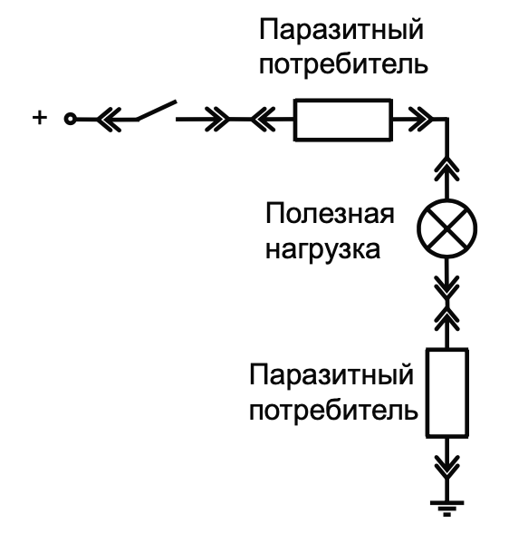{ align=left } 

Напряжение на любом элементе схемы возможно представить в виде вот такого эквивалента:  
Всегда есть источник напряжения, полезная нагрузка и паразитные потребители, «отнимающие» напряжение у полезной нагрузки.  
На практике даже на исправном автомобиле напряжение на полезной нагрузке всегда меньше напряжения источника, в качестве паразитных потребителей выступают – переходное сопротивление контактов переключателя, сопротивление проводов и разъёмных соединений.
 
!!! info inline ""

    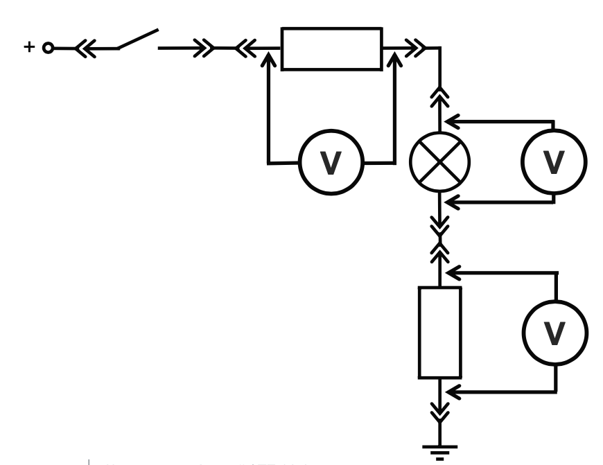{ align=left } 

Напряжение на полезной нагрузке можно измерить.  

Можно оценить падение напряжения на паразитных потребителях.  

Но на практике удобнее оценить потенциал на обоих выводах полезной нагрузки по отношению к фиксированному потенциалу (полюса АКБ).

 
!!! info inline ""

    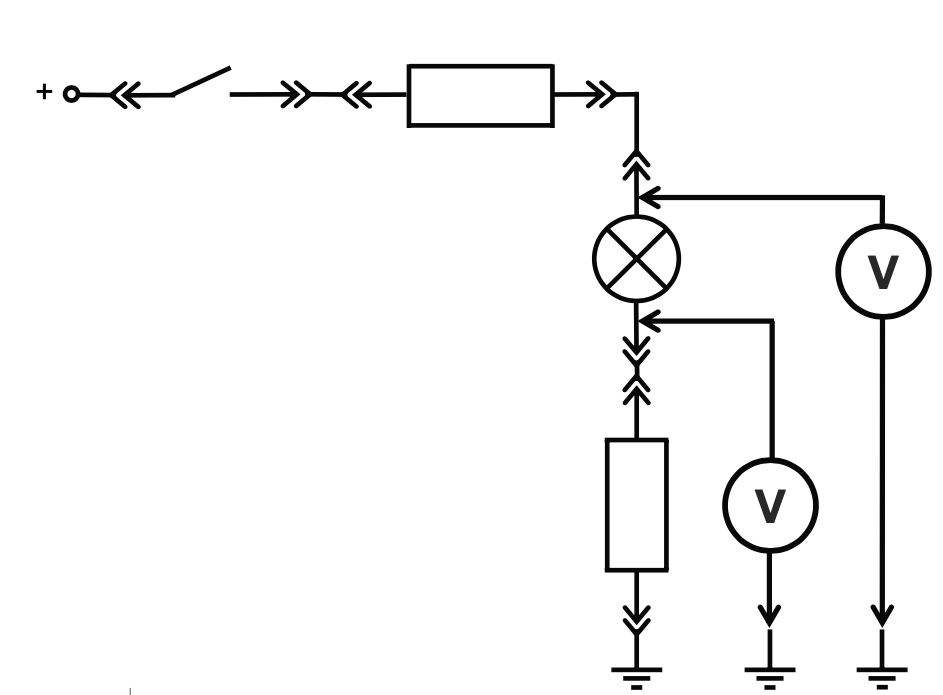{ align=left } 

Здесь показан замер напряжения на выводах полезной нагрузки относительно массы (нулевой провод) Такой вариант легче всего реализовать – один измерительный щуп мультиметра ставится на клемму АКБ или на дверную петлю или на любой не окрашенный элемент кузова, а вторым на точки замера. Сразу видно где проблема по подаче питающего напряжения.

 
!!! info inline ""

    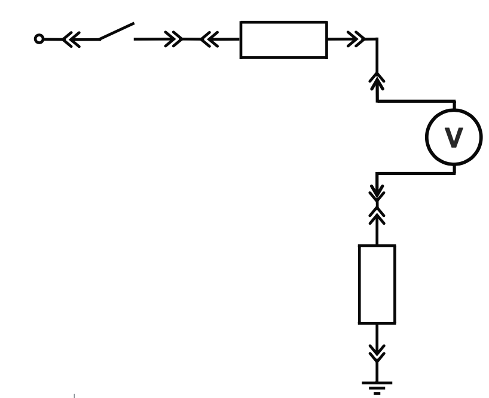{ align=left } 

Распространенная ошибка при замере напряжения – удалить элемент, на котором нужно было измерить напряжение и подключить вольтметр в разъём этого элемента.  

Замер напряжения без нагрузки некорректен. В данном включении вольтметр покажет номинал напряжения питания
Вольтметр имеет очень большое входное сопротивление, т.е. цепь фактически разорвана.  

При отсутствии токовой нагрузки паразитные потребители не имеют падения напряжения на них.

### Пример неисправности

!!! info inline ""

    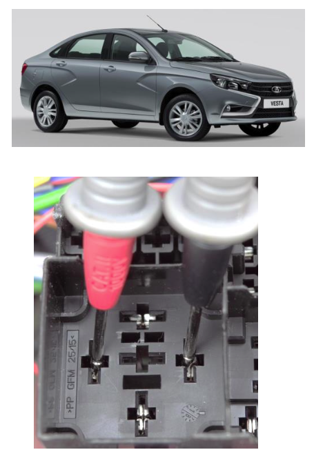{ align=left } 

На сертификации техэкспертам была переложена следующая неисправность:  

- Не заводится (не работает стартер)  
- Иммобилайзер не активен  
- АМТ в нейтрали 

Техэксперты на сертификации проверяют напряжение которое подается на управление реле стартера (фото)
Какую ошибку они совершают?

 
 

### Замер напряжения на компонентах электросистемы автомобиля

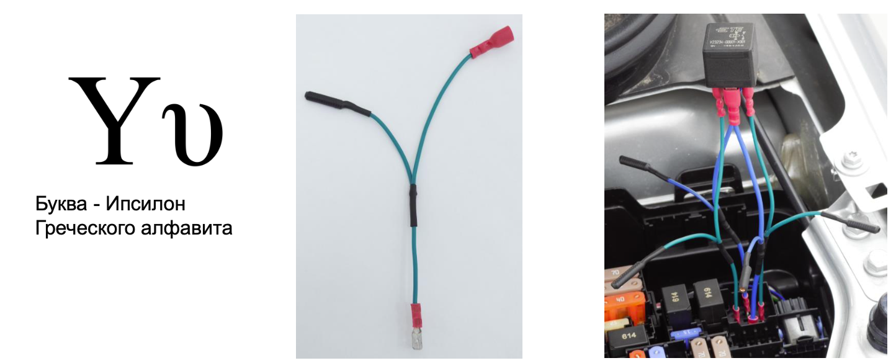
*Инженерная хитрость для замера напряжения под реальной нагрузкой – использование удлиняющих проводов с выводом для подключения измерительного прибора. (Ипсилон кабель).*

!!! info inline ""

    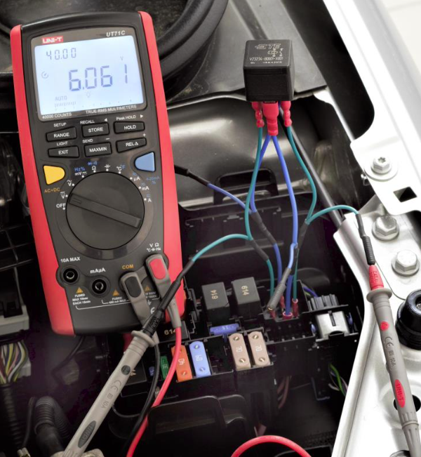{ align=left } 

Измерение под нагрузкой позволяет выявить неисправность.

Использование ипсилон кабеля имеет следующие преимущества:  

- Отсутствие разрушающего воздействия на разъёмы  
- Отсутствие разрушающего воздействия на изоляцию проводов  
- Проведение измерения под реальной нагрузкой  
- Возможность измерения изменяющихся параметров (например неисправность может проявляться непостоянно)

### Напряжение питания блоков управления

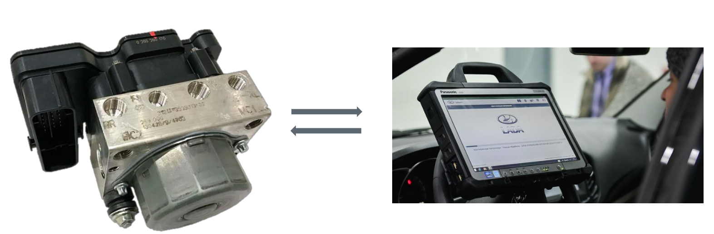
*Иногда возникает необходимость измерить напряжение питания на блоке, доступ к которому затруднен.*

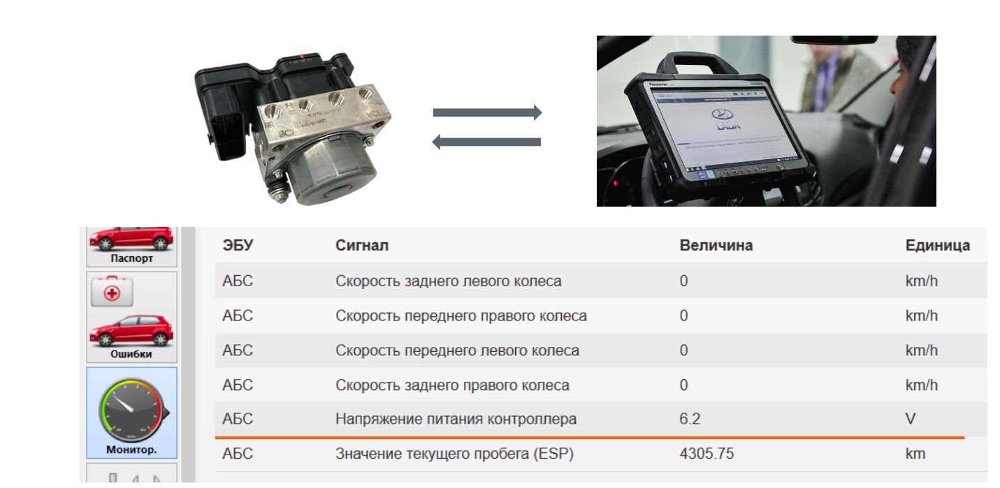
*Для начала диагностики можно воспользоваться возможностью мониторинга параметров в том виде, как их воспринимают АЦП в блоке.*

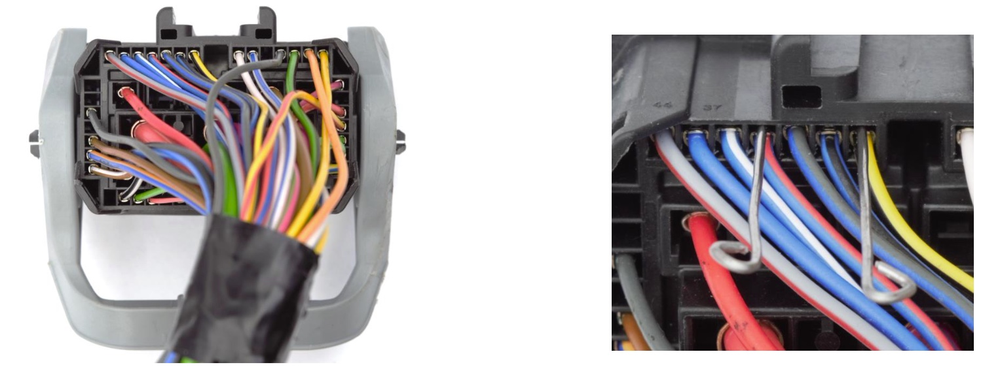
*Корректный замер напряжения питания на блоках управления в салоне автомобиля возможен с тыльной стороны негерметичного разъёма.*

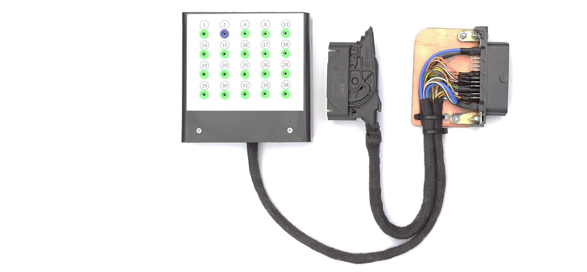
*Корректный замер напряжения питания на блоках управления в моторном отсеке – используется ипсилон кабель.*

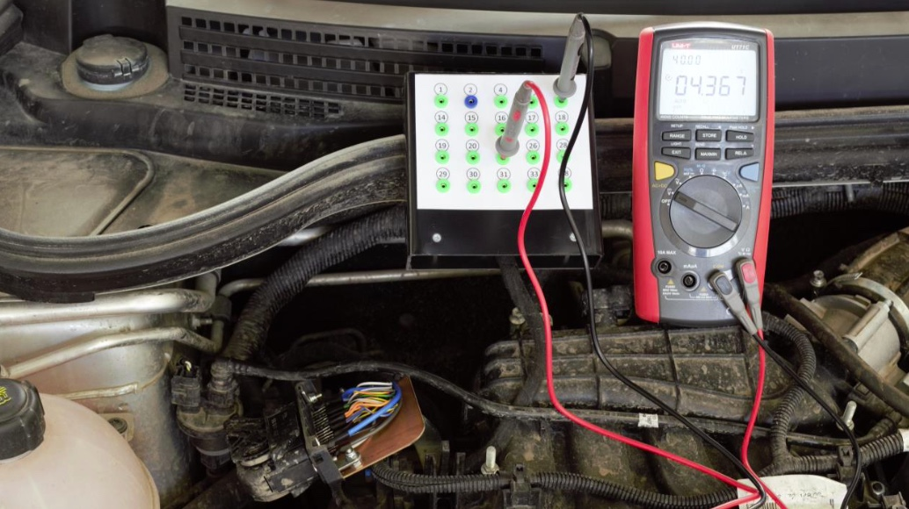
*Демонстрация измерения при неисправности, приводящей к неработоспособности конкретного блока.*

### Пример неисправности

- Иногда не заводится (не работает стартер)
- Иммобилайзер активен
- Записывается ошибка

- Осуществлена контрольная перестановка блоков на другой автомобиль (ЦБКЭ+КСУД)
- Неисправность «переползает» с блоками

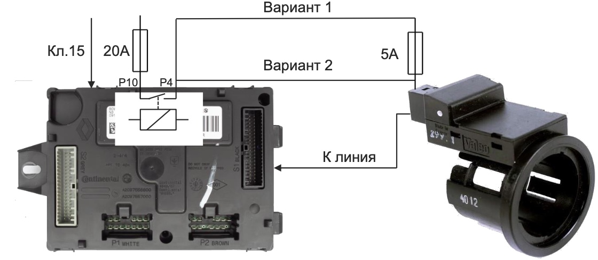
*Блок BCM (ЦБКЭ) имеет встроенное реле, которым коммутирует напряжения питания на некоторые устройства, в т.ч. на блок антенны иммобилайзера. Косвенно напряжение питания блока антенны блок BCM контролирует по уровню сигнала цифровой линии (К линия). Для проверки версии, что встроенное реле дефектно, нужно отследить динамику напряжения на выводе P1-04 блока BCM.*

Стрелочные измерительные приборы, хотя уже практически вышли из обихода, но имеют преимущество перед цифровыми – большую чувствительность в динамике, т.е. при «провале» в напряжении на короткий период стрелка дрогнет.  
Большей частью используются цифровые мультиметры, а им свойственна определённая инерционность в измерениях. Поэтому можно пропустить кратковременный дефект в напряжении питания. Удобным средством измерения в данной ситуации может стать осциллограф, но можно для начала использовать дополнительные возможности мультиметра.

!!! info inline ""

    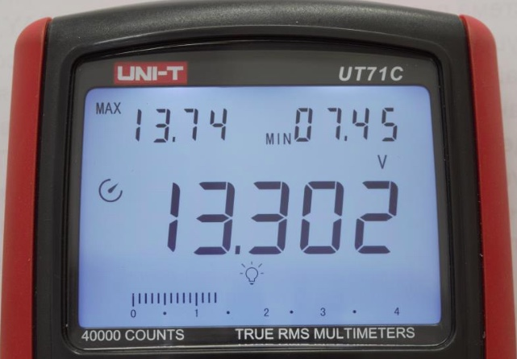{ align=left } 
В штатном функционале многих мультиметров есть фиксация минимальных и максимальных значений.

Кроме того, ниже основного дисплея есть так называемая шкала bargraph. Это некоторая аналогия со стрелкой стрелочного вольтметра.  
Если напряжение по выходу реле имеет «провалы», то возможно, контакты реле обгорели от повышенного тока, внесенного неисправным потребителем, который необходимо найти. Возможно, нестабильное напряжение поступает на вывод P1-10. Если же напряжение стабильно, вероятен внутренний дефект BCM по входу цифровой линии.