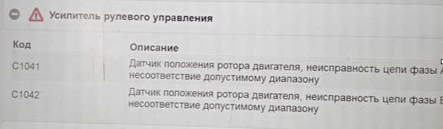
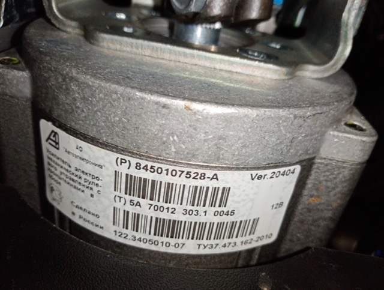

# Lada Granta 2022, пробег 6 000 км  При повороте руля отключается ЭУР. Ошибки C1041, C1042

Проявление неисправности - при повороте руля отключается ЭУР.  

Зафиксированы ошибки в ЭБУ - С1041, С1042. 

После удаления и перезапуска с вращением руля появлялась ошибка С1041.  

После перезапуска ЭУР работает, при повороте на 10-15 град. отключается с характерной отдачей.  
Требуется замена ЭУР.

