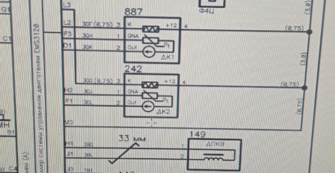
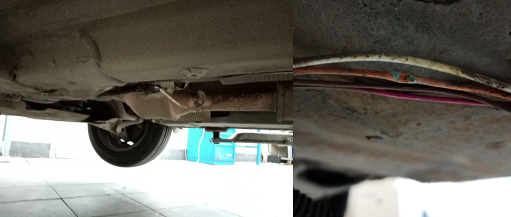

# Lada Largus 2017, к4м, EMS 3120  Горит чек. Ошибка P0141-13 Обрыв цепи подогревателя датчика кислорода 2

Ошибка P0141-13 Обрыв цепи подогревателя датчика кислорода 2. Активная, появляется сразу после запуска двигателя.

Датчики кислорода на электросхеме:

242 - датчик кислорода после нейтрализатора  
4 - плюс после главного реле,  
3 - управление нагревателем, эбу подает минус.  

Проверка сопротивления нагревателя дк2:  
два белых провода - контакты 3 и 4. Сопротивление - 6 Ом. На исправном дк1 - 4 Ом. Нагреватель в дк2 исправен.  
 
Для точной проверки сделана подмена. Вместо дк2 подключен дк1 с заведомо исправным нагревателем. К колодке дк1 ничего не подключено. Перестановка выполнена без снятия датчиков, жгут от дк2 дотянулся до разъема дк1.  

Выполнено несколько запусков для фиксации ошибок. Появилась та же ошибка по цепи нагревателя дк2 - датчик заведомо исправен, следовательно, неисправность находится в электропроводке. Также появилась ошибка по цепи нагревателя дк1, тк он отключен.  

Проверка напряжения относительно - акб на контакте 4, на дк1 и дк2 есть 12 в при включении зажигания. На контакте 3 дк2 тоже 12 в. На контакте 3 дк1 менее 1 В. Эбу не подключает нагреватель к массе и на нем не происходит падения напряжения.  

Требуется проверка целостности провода от эбу до контакта 3 дк2. Разъем снят. По схеме с 3 контакт дк2 приходит на L3 эбу. Нижний из трех разъем на эбу. Сопротивление бесконечное, есть обрыв. С дк1 3 контакт приходит на тот же разъём эбу на L2. Сопротивление 0,5 Ом - провод исправен. 
Наиболее вероятное место обрыва - снизу. Обрыв был недалеко от разъема дк2. 

*Наиболее вероятное место обрыва - снизу. Обрыв был недалеко от разъема дк2.*

Провод восстановлен. Сопротивление от L3 эбу до 3 контакта дк2 стало менее 1 Ом. Ошибка больше не фиксировалась. 

???- info "Диагностическая карта"
       Диагностическая карта для кода 0141-13 из документации ЛАДА

    | **Код неисправности** | **P0141-13** |
    |-----------|-----------|
    | **Условия обнаружения (готовность)** | 10 В < напряжение бортсети < 16 В; [[двигатель работает на холостом ходу; активирован выход управления нагревателем ДДК] или зажигание включено] |
    | **Условия обнаружения (тест)** | Аппаратная диагностика |
    | **Время обнаружения неисправности** | 2000 мс |
    | **Время подтверждения отсутствия неисправности** | 2000 мс |
    | **Параметры** | Давление в коллекторе  Напряж.нижн.датчика кислорода  Подогрев нижнего кислородного датчика  Цикл.отн.откр.подогрева нижн.датчика  Регулировка состава смеси |
    | **Диагностическое подтверждение** | Двигатель работает на холостом ходу |
    | **Возможные причины** | Неисправен жгут проводов;  Неверное или ненадежное соединение колодок жгута проводов, ДДК, КСУД;  Неисправен ДДК;  Неисправен КСУД |
    | **Порядок диагностики** | 1 Проверить целостность проводов и изоляции жгута проводов к разъемам ДДК и КСУД. Осмотреть разъемы ДДК, КСУД, колодки жгута на полноту и правильность сочленения, на исправность замков и контактов, на качество соединения контактов с проводом. Неисправность обнаружена?  - да – устранить обнаруженную неисправность и выполнить послеремонтные операции;  - нет – перейти к шагу 2.  2 Проверить целостность электрических цепей питания и управления нагревателя ДДК, проверить отсутствие замыкания цепи управления нагревателя ДДК на массу и на бортовую сеть. Неисправность обнаружена?  - да – устранить обнаруженную неисправность и выполнить послеремонтные операции;  - нет – заменить УДК и выполнить послеремонтные операции |
    | **Послеремонтные операции** | Удалить код неисправности из памяти КСУД и выполнить диагностическое подтверждение |