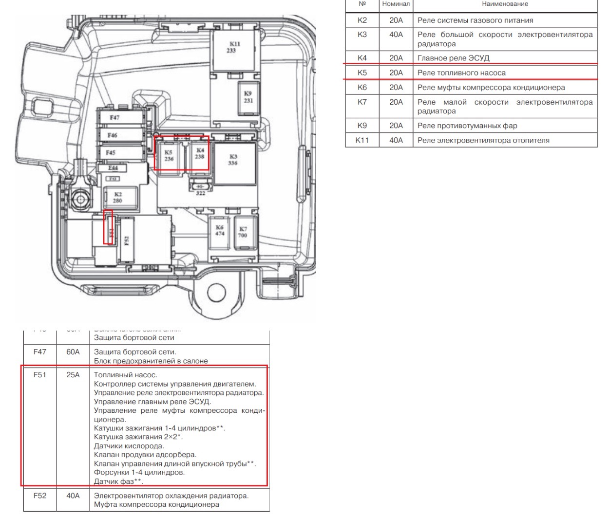
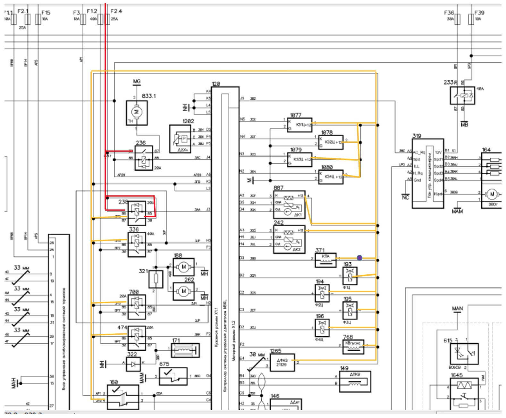
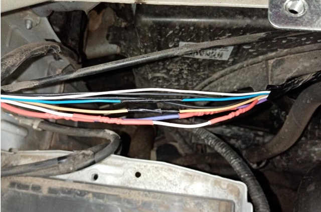
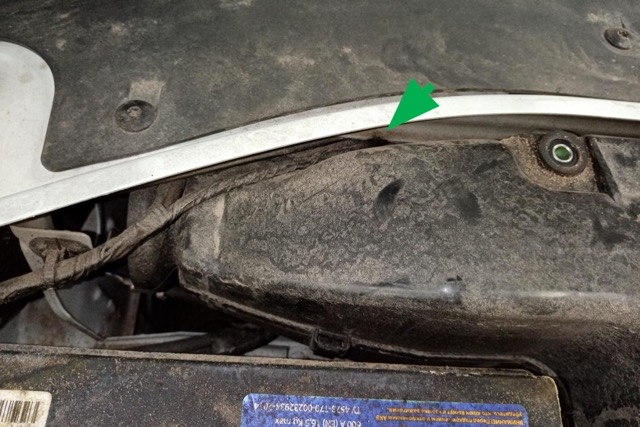

# Lada Largus 2020, 21129  Не запускается

ДВС не запускается, на приборной панели загораются контрольные лампы, ДВС прокручивается стартером с достаточной скоростью, вспышек в цилиндрах нет. При включении зажигания не слышно срабатывания бензонасоса, так же как и при прокрутке стартером.  
Проверка предохранителей.

Предохранитель F51 на 25 А сгоревший. Предохранитель стоит в цепи питания нескольких потребителей, в числе которых – бензонасос и ЭБУ двигателя, соответственно, этот сгоревший предохранитель имеет отношение к незапуску.  

Проверить провод питания к потребителям, указанным в списке в описании предохранителя F51.  

Анализ схемы.  
Предохранитель F2.4 25 А запитан от плюса АКБ (30 клемма) далее цепь идет на реле бензонасоса 236 (30 силовой контакт)
главное реле ЭСУД 238 (86 контакт катушки и 30 силовой)  
Красной линией показан провод до главного реле.  

Далее, согласно схеме, после подачи ЭБУ двигателя массы на 85 контакт катушки главного реле 238 замыкаются контакты реле, и плюс после предохранителя F2.4 25 А подается на  
реле электровентилятора радиатора 336 (86 контакт катушки)  
реле малой скорости электровентиляторов радиатора 700 (86 контакт катушки)  
реле муфты компрессора кондиционера 474 (86 контакт катушки)  
выключатель стояночного тормоза 160 (контакт 4)  
катушки зажигания 1077 – 1080 (контакт 3)  
датчики кислорода  887 и 242 (контакт 4 нагревателя)  
клапан продувки адсорбера 371 (контакт 1)  
форсунки 193 – 196   
клапан впускного коллектора 761 (контакт 1)  
датчик фаз 1265 (контакт 2)  

Оранжевым цветом показан провод после главного реле.  

проверка мультиметром в разъеме пред. - замыкание постоянное.  

Осмотреть проводку, можно отсоединять разъемы потребителей. Сопротивление на данном  проводе относительно массы, измеренное, например на контакте 3 разъема катушки зажигания не должно быть близким к  0 Ом, что указывало бы на замыкание на массу. При измерении сопротивление было приблизительно 0 Ом.

Место замыкания находилось в передней левой части автомобиля. Жгут проводов был зажат между передней панелью кузова и воздухозаборником, вследствие чего был перетерт. Место контакта показано на схеме фиолетовым кругом. 

