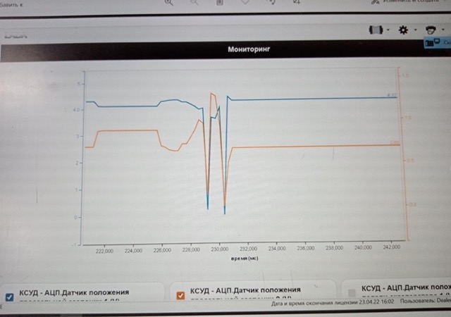
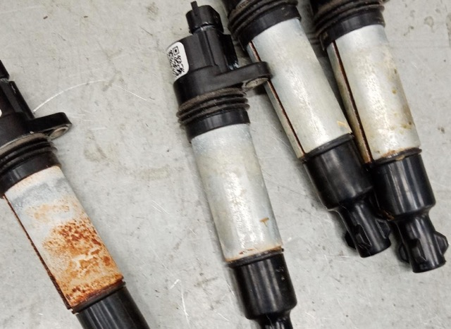

# Lada Xrey  1,6 М86  При движении и нажатии на газ загорается чек, лампа ABS, пропадает реакция на педаль газа

При движении и нажатии на газ (увеличении нагрузки) загорается чек, лампа ABS, перестает реагировать на педаль газа (включается аварийный режим работы ЭБУ). При перезапуске и удалении ошибок не проявляется до следующего повторения описанных условий.  

Фиксируются коды в ЭБУ двигателя:  
Р0122 Низкий уровень сигнала датчика 1 дроссельной заслонки  
Р0222 Низкий уровень сигнала датчика 2 дроссельной заслонки  
Р2135 Корреляция сигналов датчиков положения дроссельной заслонки  

Один раз появилась ошибка по низкому уровню сигнала датчика положения педали газа.  
В блоке абс появлялась ошибка - неверные данные от системы впрыска.  
Набор ошибок по двс каждый раз был разный из тех, которые указаны выше.  
Проверка по коду о низком уровне сигнала. Проверено питание датчиков 5 в на разъеме, целостность проводов от ЭБУ до разъема дросселя, состояние разъемов, изменения показаний при открытии дросселя и нажатии на педаль газа. Все нормально.

*Сигналы с датчиков положения дроссельной заслонки в момент проявления неисправности. Оба сигнала кратковременно падают до 0В*

*Состояние катушек зажигания*

Ранее были пропуски воспламенения, которые проявлялись и на холостом ходу.  
После очистки катушек и свечей от окислов пропуски на холостом ходу не проявлялись.  
Устанавливался заведомо исправный дроссель. Изменений не было.  
Заменены все катушки зажигания (из-за подозрения на возможное пробивание катушки на массу на блок и влияние на питание датчиков).  

После замены катушек неисправность не проявлялась. 