# Hyundai Elantra 2002 г. Стартер не вращает двигатель

### Симптомы  
Автомобиль не запускается, нет прокрутки стартером.

---
### Подтверждение наличия неисправности и первичная проверка
Проверка реакции при запуске: включить зажигание, повернуть ключ в положение START.  
Двигатель не вращается, стартер не издает звуков, щелчка втягивающего реле нет.  
Необходимо проверять цепь запуска, аккумулятор, цепь управления стартером, стартер, селектор АКПП (Park/Neutral switch).

---
### Быстрая проверка аккумулятора
Включить фары, повернуть ключ на запуск, наблюдать изменение яркости.  
Фары светят ярко, при запуске они не показывают явной просадки.  
Следовательно, вероятность разряженного аккумулятора низкая.  
Так как на некоторых автомобилях фары автоматически отключаются при запуске, можно посмотреть на плафон в салоне и при этом попытаться запустить двигатель.  
Свет салона не изменяет яркость.  
Следовательно, аккумулятор способен держать нагрузку, основная проблема, скорее всего, не в аккумуляторе.

---
### Проверка положения селектора АКПП
Проверить выключатель Park/Neutral. Перевести селектор в положение Neutral. Попробовать запустить двигатель.  
Стартер по-прежнему не работает. Выключатель Park/Neutral не является причиной неисправности.

---
### Проверка стартера ударом по втягивающему реле или корпусу стартера
Слегка постучать по корпусу втягивающего реле, одновременно попробовать запустить двигатель.  
Реакции нет.  
Не подтверждена неисправность стартера этим быстрым тестом, требуется дальнейшая диагностика.

---
### Проверка питания стартера
На стартере должно присутствовать постоянное напряжение аккумулятора (+12 В).  
Силовой провод B+ подключен напрямую к аккумулятору. 
Проверка контрольной лампой или мультиметром.  
Контрольная лампа подключается к массе.  
Лампа горит постоянно - постоянное питание стартера присутствует.  
Проблема не в силовом кабеле.  
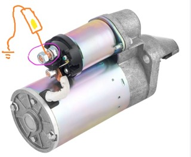  

---
### Управляющий сигнал стартера (S terminal)
Тонкий провод. Контрольная лампа подключается к массе. Проверяется наличие +12 В при положении ключа START.  
Если сигнал есть, но стартер не работает, то неисправен стартер.  
Если сигнала нет следует искать проблему в цепи управления: замок зажигания, реле стартера, выключатель Park/Neutral, проводка, блок управления. 
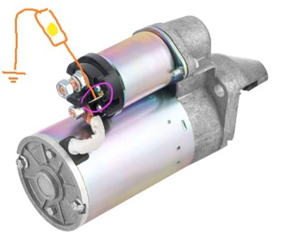   
 
При попытке запуска лампа не загорается.  
На управляющий вход стартера не приходит сигнал запуска. 

---
### Проверка запуска через Power Probe
Проверить сам стартер, подав питание напрямую. Подать питание на управляющий вывод стартера через Power Probe, Проверить реакцию стартера.  
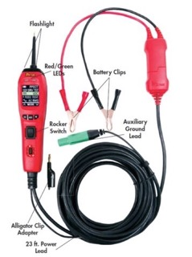  

Двигатель запускается.  
Стартер исправен. Проблема находится в цепи управления стартером.

---
### Проверка цепи управления стартером
Требуется проверить реле стартера, контакты блока реле, замок зажигания, выключатель Park/Neutral, проводка между реле и стартером. 

###  Проверка реле стартера
По звуку обнаружено,что при повороте ключа слышно срабатывание реле в подкапотном блоке предохранителей.
Найти реле стартера по схеме расположения, снять реле, проверить состояние контактов.  
Обнаружена коррозия и следы предыдущего вмешательства, контакты выглядят поврежденными.  
Проблема может быть в реле стартера или контактах блока реле.

<ins>Проверка реле заменой</ins>  
Заменить реле стартера на аналогичное, Проверить запуск двигателя.  
Перед заменой необходимо убедиться, что реле имеют одинаковое количество контактов и одинаковую внутреннюю схему.

После замены запуск не появился.

Реле, которое щелкает, не обязательно исправно. Щелчок означает только что катушка реле получила питание, механический контакт переместился. Но не свидетельствует о исправности силовых контактов и способности пропускать ток.

### Проверка цепей реле  
<ins>Проверка управляющей цепи реле</ins>  
Проверяется, есть ли питание на катушке реле при запуске. Контрольная лампа подключается к массе. Проверяется вывод управления при положении START. Затем проверяется второй контакт управляющей цепи, подключенный к массе.   

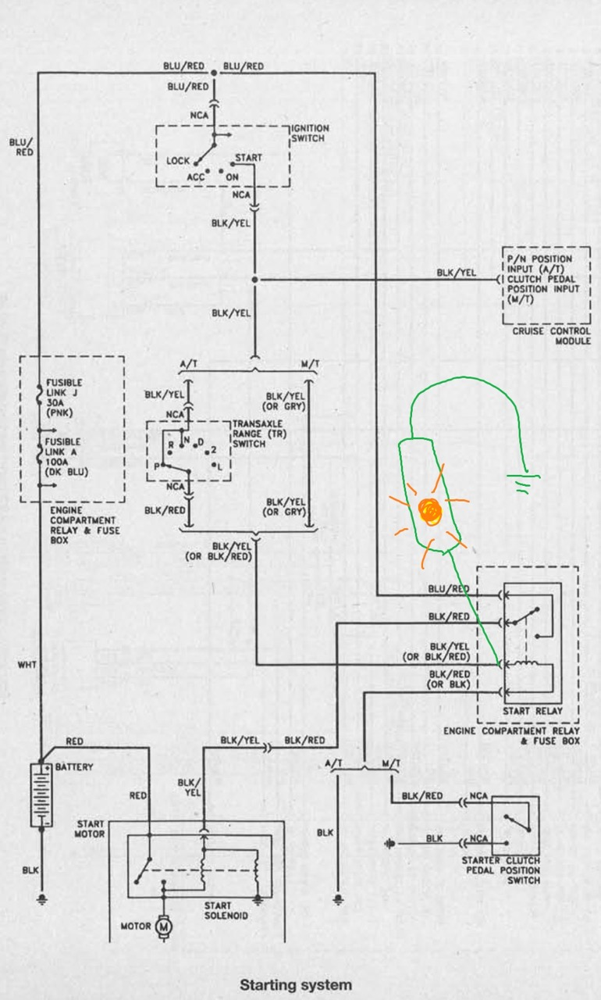

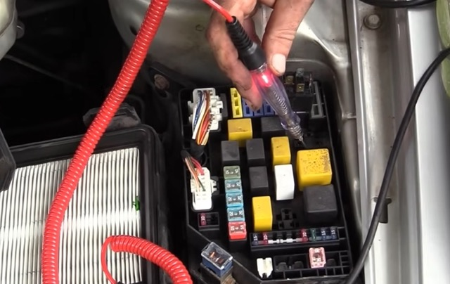
*Питание управления присутствует*

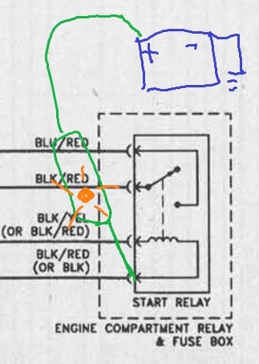
*Масса присутствует*

<ins>Проверка силовой стороны реле</ins>  
Проверяется постоянное питание на входе реле.

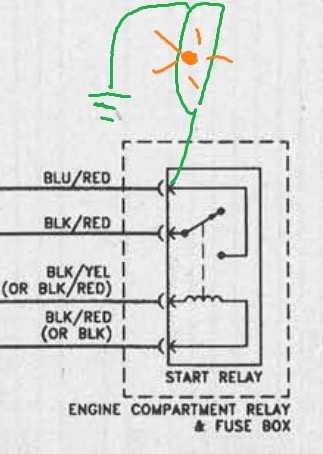

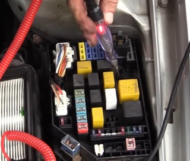
*Питание присутствует*

 

Следовательно для работы стартера имеются необходимые условия: питание аккумулятора есть, питание на реле есть, команда включения есть.  
Но выход на стартер отсутствует.

<ins>Проверка выхода реле</ins>  
Проверить провод от реле к управляющему выводу стартера.  
Проверить наличие массы/цепи через управляющий провод.  
Использовать Power Probe для подачи питания напрямую.

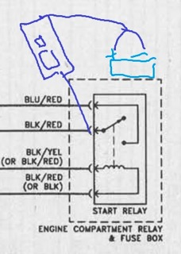

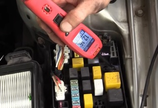

 

Запуска нет. Цепь не работает под нагрузкой.  
Следовательно, есть проблема в цепи после реле.

---
### Проверка проводки
<ins>Проверка цепи после реле стартера</ins>  
Провод от реле идет на управляющий вывод втягивающего реле стартера (S terminal).  
Когда стартер выключен этот провод может показывать массу через обмотку соленоида стартера.  

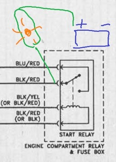

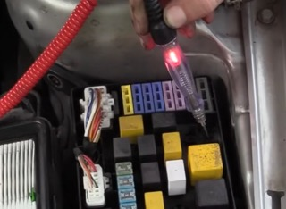
*Если нагружать цепь лампой, она работает и лампа светится*

 

Однако, если подать питание на вывод реле, который идет к управляющему контакту на стартере, ток перестает проходить и прибор перестает видеть заземление.

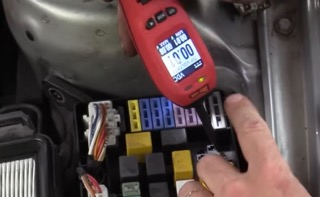
*Прибор показывает массу через обмотку соленоида втягивающего реле*

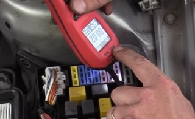
*После подачи нагрузки масса пропадает*

 

Аналогичная проверка на выходных контактах блока предохранителей

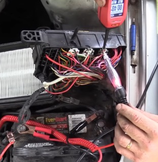
*Лампа горит, так как подключена к массе через обмотку соленоида, зажим лампы на + акб*

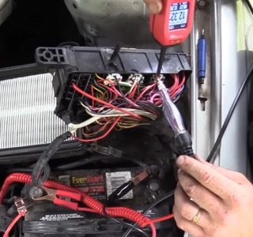
*После подачи нагрузки масса пропадает и лампа гаснет*

 

Без нагрузки и при малой нагрузке цепь показывает наличие соединения. При  попытке запустить стартер, то есть с более высокой нагрузкой ток пропадает.  
Следовательно, присутствует высокое сопротивление внутри провода.

<!-- #region ??? info -->
??? info "Почему нельзя доверять простой проверке мультиметром"
    Провод с коррозией может показывать наличие напряжения и наличие контакта.  
    Но при подключении нагрузки ток не проходит, напряжение падает и устройство не работает.  
    Поэтому цепи запуска необходимо проверять под нагрузкой.
<!-- #endregion -->

### Поиск места повреждения
<ins>Принцип поиска</ins>  
При высоком сопротивлении необходимо искать места нагрева, места вибрации, повреждения жгута, места попадания воды.  

Проверка жгута: провод от реле проходит вниз к стартеру, имеется разъем в жгуте.
Участок от разъема вверх исправен. Проблема находится ниже по цепи.  

Проверка соединения на стартере. Проблема может находиться в самом разъеме стартера, в контакте S terminal.  
Пошевелить разъем на стартере, одновременно контролировать цепь.
При движении разъема контакт появляется и пропадает, стартер иногда получает сигнал.  
Следовательно, неисправен разъем/наконечник управляющего провода стартера.

Контакт сломан, провод имеет сильную коррозию, коррозия распространилась вверх по жгуту.  

---
### Ремонт
Восстановлен контакт разъема.  
Результат - стартер работает, двигатель запускается.  

---
[видео ScannerDanner](https://www.youtube.com/watch?v=oo1SRIFIkhs){target="_blank"}