# Ошибка нагревателя кислородного датчика (O2 Heater Circuit) на Volkswagen P0135

### Симптомы
- Горит Check Engine

Диагностический код:

- P0135 Bank 1 Sensor 1 Heater Circuit

Код указывает на неисправность цепи нагревателя верхнего кислородного датчика (до каталитического нейтрализатора).

---
### Возможные причины
<!-- #region ??? info -->
??? info "Краткая справка о датчиках кислорода"
    Применяются широкополосные и узкополосные датчики.  
    Узкополосный датчик работает как переключатель, фиксируя два состояния топливной смеси - бедное и богатое. Обычно имеет 4 провода.  

    Широкополосный датчик позволяет измерять широкий диапазон состава смеси. Обычно имеет 5 проводов.

    Кислородный датчик начинает работать только после достижения высокой температуры.
    Без нагрева химическая реакция внутри датчика невозможна.  
    Поэтому внутри датчика находится нагревательный элемент.

    ЭБУ подает:

    - питание;
    - управляемую массу,

    тем самым быстро разогревая датчик до рабочей температуры.
<!-- #endregion -->

Причиной неисправности могу быть:  

- неисправность нагревательного элемента внутри кислородного датчика;
- обрыв проводов;
- плохой контакт в соединительных разъемах;
- отсутствие питания;
- отсутствие управления со стороны ЭБУ, неисправность ЭБУ
---
### Как определить провода нагревателя
Во многих автомобилях два провода нагревателя имеют одинаковый цвет.
Это позволяет быстро определить цепь нагревателя.
В данном Volkswagen все провода разного цвета.
Поэтому приходится использовать электрическую схему.
При определении следует руководствоваться в первую очередь номерами контактов в разъеме, так как цвета проводов на автомобиле и на схеме могут отличаться.  
Также нагреватель потребляет значительно больший ток, чем измерительная часть датчика, поэтому его провода могут иметь большее сечение.

---
### Работа со схемой
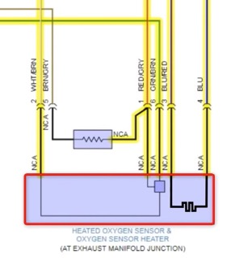  
Датчик на автомобиле имеет 5 проводов - это широкополосный датчик.

---
### Проверка тока
Токовые клещи устанавливаются на один из проводов нагревателя. Диапазон измерения выставлен примерно на 5 А. Обычно нагревательный элемент датчика потребляет 1 - 2 ампера.  
Токовые клещи подключены ко второму каналу осциллографа (зеленый график)
После запуска двигателя ток = 0 А.  
Иногда ЭБУ может задерживать включение нагревателя, следует подождать несколько секунд после пуска двигателя.
Отсутствие тока не означает автоматически, что неисправен сам датчик. Причинами могут быть отсутствие питания, отсутствие массы, обрыв нагревателя, неисправность драйвера ЭБУ.

<div class="grid" markdown>

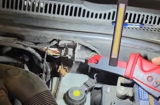

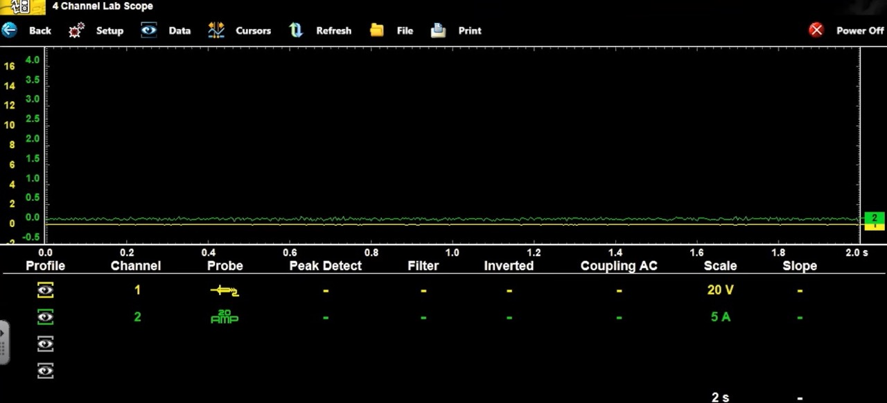

</div>

Следующий этап — измерение напряжения.

---
### Проверка напряжения
Требуется подсоединить контакт заземления щупа к отрицательной клемме акб и вставить измерительный щуп в контакт проводов нагревательного элемента датчика в разъеме.  
Используется первый канал (график желтого цвета)
Получены следующие результаты:  

<div class="grid" markdown>

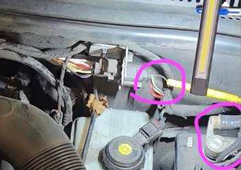

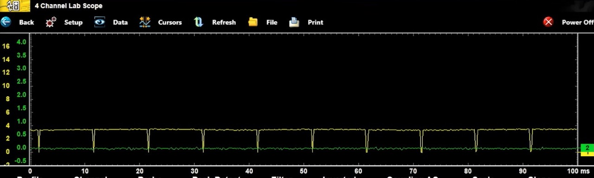

*На первом проводе: около 3,5 В с небольшими импульсами*

</div>

  

<div class="grid" markdown>

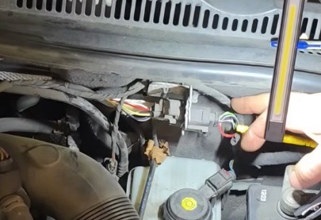

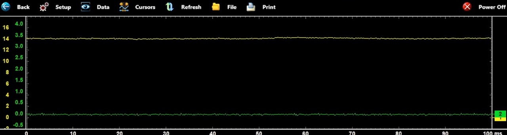

*На втором проводе: 12 В*

</div>

---
### Как работает исправная цепь
```text
+12 В
  │
  │
Нагреватель
  │
  │
Транзистор ЭБУ
  │
  │
 Масса
```

Транзистор внутри ЭБУ замыкает и размыкает цепь. Именно он управляет нагревателем.

---
### Интерпритация полученных значений. Что такое Bias Voltage
Полученные 3–3,5 В — это не ошибка измерения.  
Это специальное диагностическое напряжение, которое формирует ЭБУ.  
Оно называется Bias Voltage (смещающее напряжение)  
ЭБУ постоянно контролирует целостность цепи нагревателя.

Для этого внутри блока управления имеется резистор и схема контроля.

Через нее на управляющий провод подается небольшое напряжение. Если цепь оборвана, ЭБУ видит примерно 3–5 В и записывает ошибку Heater Circuit Open.

Измерения показали: питание присутствует; ток отсутствует; на управляющем проводе присутствует Bias Voltage.

Это означает, что нагревательный элемент внутри кислородного датчика имеет обрыв.

---
### Почему это подтверждает исправность ЭБУ

Если присутствует Bias Voltage, значит проводка до ЭБУ исправна; вход ЭБУ исправен; схема диагностики ЭБУ работает.  
Следовательно, наиболее вероятная причина — неисправный нагреватель внутри самого датчика.

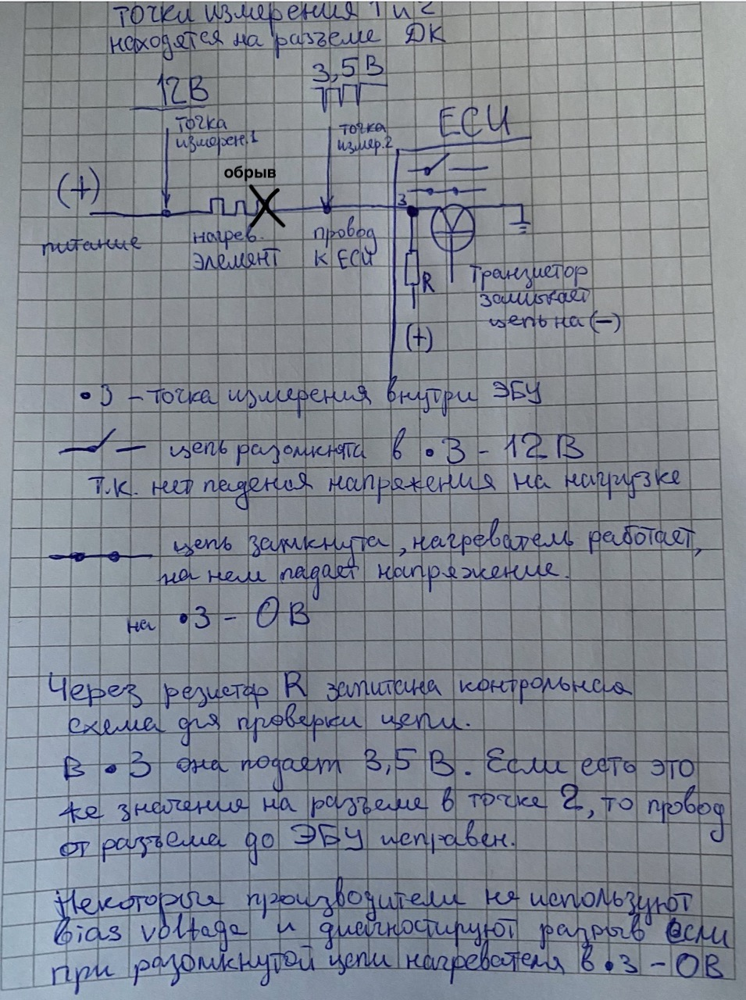  

---
### Проверка контрольной лампой
Контрольная лампа имитирует нагрузку. Иногда требуется сбросить ошибки в ЭБУ, чтобы он начал включать драйвер.
Контрольная лампа подключается к плюсовой клемме акб, щупом к проводу нагревателя, который идет от ЭБУ, который драйвер замыкает на массу при включении.  
Если драйвер исправен, лампа должна светиться либо мигать.

ЭБУ управляет нагревателем методом PWM (Pulse Width Modulation) (ШИМ). То есть масса подается импульсами. Из-за этого контрольная лампа светится не на полную яркость. Чем шире импульс, тем ярче светится лампа.  

Такая проверка не всегда может подходить из-за особенностей измерения тока конкретными ЭБУ.

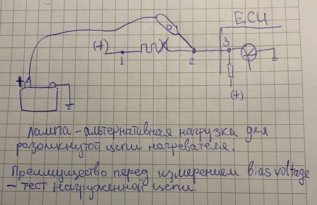

<div class="grid" markdown>

<div markdown>

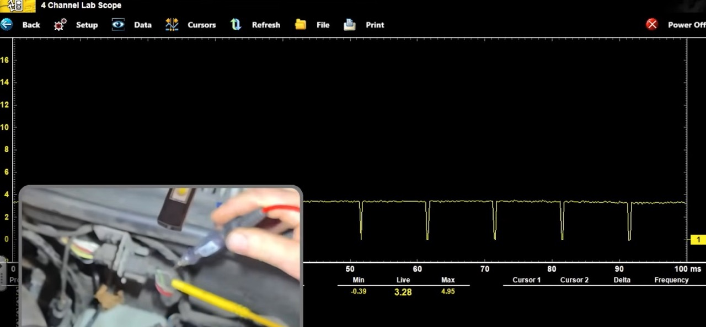

*Шуп лампы не подсоединен к проводу. Напряжение в точке 2 - 3,5 В из ЭБУ*

</div>

<div markdown>

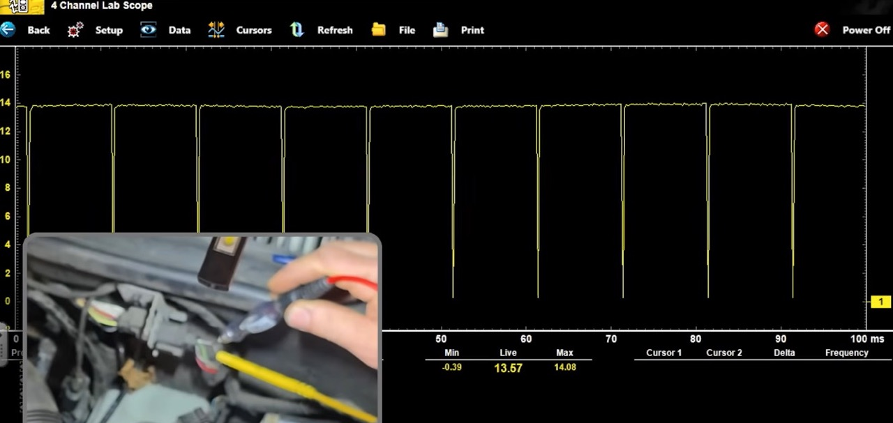

*Шуп лампы подсоединен к проводу. Напряжение в точке 2 - около 12 В через лампу*

</div>

</div>

---
### Зачем используется PWM
ЭБУ не держит нагреватель постоянно включенным. Он регулирует мощность нагрева. Это позволяет быстрее прогреть датчик, избежать перегрева, уменьшить потребление электроэнергии.

---
### Проверка после установки нового датчика
После замены кислородного датчика измерения повторяются.

Полученные результаты:  
питание около 12 В;  
ток 1–2 А;  
на осциллографе наблюдается нормальная PWM-модуляция.

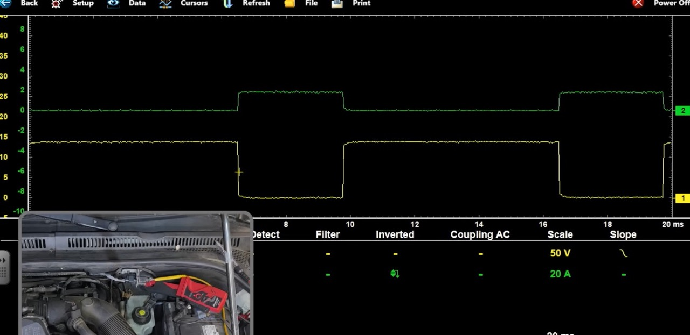  

*Во время включения транзистора напряжение падает почти до 0 В (желтый график), одновременно появляется ток (зеленый график). После отключения ток исчезает, напряжение снова становится 12 В*

---
### Проверка контрольной лампой после ремонта
После установки нового датчика контрольная лампа светится значительно ярче, так как ЭБУ увеличивает длительность управляющих импульсов (PWM).  
Это подтверждает исправность драйвера ЭБУ, проводки, нового нагревателя.

---
### Итог диагностики
Причина неисправности:
Обрыв нагревательного элемента внутри кислородного датчика.

---
[видео ScannerDanner](https://www.youtube.com/watch?v=NlyX7jqKp_c){target="_blank"}