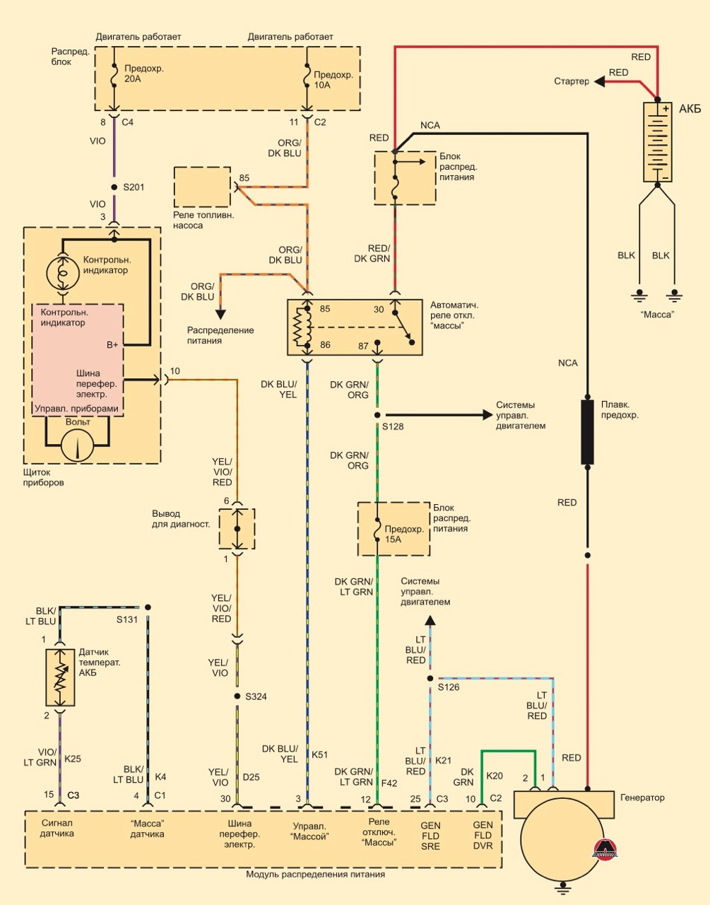
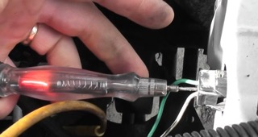
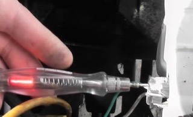
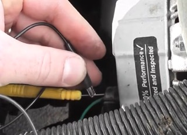
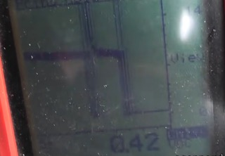
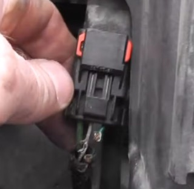

# Jeep Grand Cherokee WJ 1999-2004 Проверка генератора

### Симптомы  
Аккумулятор постоянно разряжается.  
Предварительно предполагалась паразитная утечка тока, но после проверки выяснилось, что проблема связана с системой зарядки.

---
### Первичная проверка системы зарядки
Запустить двигатель и проверить напряжение аккумулятора при работающем двигателе.  

Напряжение аккумулятора при неработающем двигателе 11.8 В. При работающем двигателе напряжение не повышается.  
Генератор не заряжает аккумулятор.

---
### Описание системы  

Система зарядки состоит из:

генератора  
схемы электронного регулятора напряжения (EVR), расположенной внутри модуля управления силовым агрегатом (PCM);  
замка зажигания;  
аккумуляторной батареи;  
датчика температуры аккумуляторной батареи;  
контрольной лампы генератора (если установлена);  
контрольной лампы Check Gauges («Проверьте приборы») (если установлена);
вольтметра;  
жгута проводов и электрических соединений.  

Модуль распределения питания здесь - PCM - ЭБУ двигателя  

<ins>Принцип работы</ins>

Система зарядки включается и выключается замком зажигания.  
Система находится во включенном состоянии, когда двигатель работает и реле автоматического отключения (ASD) находится под напряжением (включено).  
Когда реле ASD включено, напряжение подается на цепь контроля реле ASD в модуле PCM.  
Это напряжение проходит через PCM и подается на один из выводов обмотки возбуждения генератора (Gen. Source +) на задней части генератора. (На схеме - светло-голубой/красный провод к генератору)  
Количество постоянного тока, вырабатываемого генератором, регулируется схемой EVR (управления током возбуждения), расположенной внутри PCM.  
Эта схема включена последовательно между вторым выводом обмотки возбуждения ротора и массой. (На схеме зеленый провод к генератору)  
Датчик температуры аккумуляторной батареи, расположенный в корпусе поддона аккумулятора, используется для измерения температуры аккумуляторной батареи.  
Информация о температуре, вместе с данными о контролируемом напряжении бортовой сети, используется PCM для изменения режима зарядки аккумуляторной батареи.  
Это осуществляется путем периодического замыкания цепи на массу, что позволяет изменять силу магнитного поля ротора.  
Этим PCM соответствующим образом компенсирует и регулирует выходной ток генератора.  
Все автомобили оснащены системой бортовой диагностики (OBD).  
Все системы, контролируемые системой OBD, включая схему EVR (управления током возбуждения), находятся под постоянным контролем PCM.  

---
### Проверка силового провода генератора (B+)
Проверка напряжение на силовой клемме генератора и сравнение его с напряжением непосредственно на аккумуляторе.

На выводе B+ генератора: 11.85 В  
На аккумуляторе: 11.88 В  
Разница составляет около 30–80 мВ.  
Падение напряжения на силовом кабеле находится в норме.  

---
### Проверка цепи управления генератором
На автомобиле установлен компьютерно-управляемый генератор с PWM-регулированием ротора.  
Генератор имеет два вывода в разъеме:  
питание ротора  (на схеме светло-голубой/красный провод на фото - белый)  
управляющий сигнал от блока управления (зеленый провод).  

Контрольная лампа для проверки подключена к минусу акб.

  
*На питающем проводе имеется 12 В*

  
*На управляющем проводе также имеется 12 В и нет сигнала управления от ЭБУ (ШИМ-регулирования) В данном случае ЭБУ должен замыкать контакт на массу, регулируя магнитное поле и мощность генератора. Напряжение на контакте есть, так как он соединен с выводом ротора, а на ротор подается питающее напряжение со второго контакта.*

 

---
### Проверка управляющей цепи контрольной лампой
Контрольная лампа подключается к плюсу аккумулятора для проверки наличия управления массой.  
Если блок управления замыкает цепь на массу, лампа должна загореться.  
Шупом лампы проверяется зеленый провод (управление от ЭБУ).
Лампа не загорается. Следовательно, цепь управления генератором не замыкается на массу.
Возникает подозрение на обрыв провода; неисправность блока управления; отсутствие управления из-за обнаруженной ошибки.  

---
### Проверка управления генератором принудительным замыканием
Для проверки генератора управляющий провод вручную временно замыкается на массу, как это делает блок управления.  
При замыкании на массу напряжение зарядки повышается до 14.3–14.4 В, изменяется звук работы генератора.  
Следовательно, генератор способен создавать зарядное напряжение, генератор исправен, проблема находится в цепи управления.  

  
*Управляющий провод замкнут на массу с помощью зажима*

  
*Напряжение на нем упало примерно до 0 В и генератор начал вырабатывать ток*

 

Необходимо проверить провод между генератором и блоком управления; состояние разъемов; повреждения проводки.

---
### Поиск повреждения проводки
При осмотре обнаружен поврежденный участок в нижней части.  
Белый провод имеет повреждение изоляции; зеленый управляющий провод полностью оборван (следы перегрызания животными).

---
### Проверка после восстановления цепи
Восстановлена проводка.  
После запуска двигателя зарядка появилась - напряжение поднялось примерно до 13.9 В и продолжило увеличиваться в пределах нормальных значений.
Генератор и система управления работают исправно после восстановления цепи.

---
### Итог диагностики
Причина неисправности: повреждение проводки генератора животным - обрыв управляющего провода цепи управления ротором.

Основные диагностические выводы:  
всегда проверять напряжение зарядки перед поиском утечки;  
при компьютерном управлении генератором необходимо проверять не только питание, но и управляющие цепи;  
измерения напряжения необходимо подтверждать дополнительными тестами (контрольная лампа, проверка нагрузки);  
перед заменой деталей необходимо убедиться в исправности проводки.  

---
[видео ScannerDanner](https://www.youtube.com/watch?v=AvLbb48tQPw){target="_blank"}