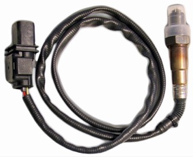

- 

    [**Ошибка нагревателя кислородного датчика (O2 Heater Circuit) на Volkswagen P0135**](O2 Sensor Heater Circuit.md)

- 

    [**Hyundai Elantra 2002 г.  
        Cтартер не вращает двигатель**](No Crank Diagnostics.md)

- 

    [**Jeep Grand Cherokee WJ 1999-2004  
        Проверка генератора**](alternator testing.md)

