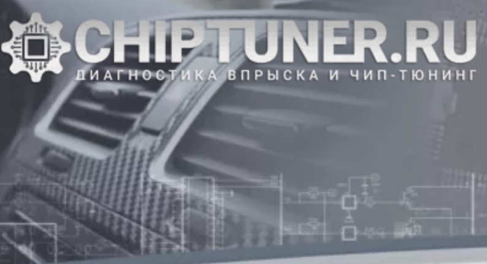
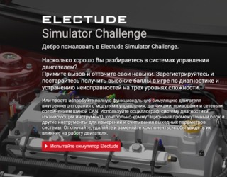
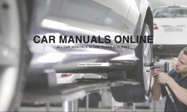
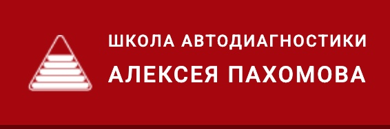
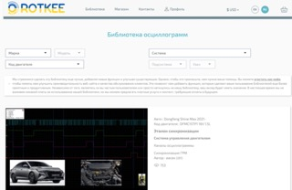
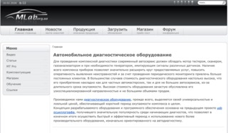
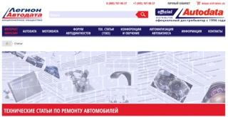

# Полезные ресурсы

!!! info inline ""

    { align=left } 

* **Сайт CHIPTUNER.RU** [ссылка](https://chiptuner.ru/).  

<small>Cайт CHIPTUNER.RU основан в 2001 году и является одним из первых и самых полных ресурсов, посвященных чип-тюнингу и диагностике неисправностей инжекторных автомобилей российского и иностранного производства.</small>

!!! info inline ""

    { align=left } 

* **Electude Simulator Challenge** [ссылка](https://simulator.electude.com/).  

<small>Добро пожаловать в Electude Simulator Challenge.  
Насколько хорошо Вы разбираетесь в системах управления двигателем? Примите вызов и отточите свои навыки. Зарегистрируйтесь и постарайтесь получить высокие баллы в игре по диагностике и устранению неисправностей на трех уровнях сложности.  
Или просто испробуйте полную функциональную симуляцию двигателя внутреннего сгорания с модулями управления, датчиками, приводами и сетевым соединением шиной CAN. Используйте осциллограф, систему диагностики (сканирующий инструмент), контрольно-коммутационный промежуточный блок и другие инструменты для измерений и считывания выходных параметров системы. Отключайте, удаляйте и заменяйте компоненты, чтобы увидеть их влияние на работу двигателя.</small>

!!! info inline ""

    { align=left } 

* **Сайт Car Manuals Online** [ссылка](https://www.carmanualsonline.info/).  

<small>Search through 80,000 car manuals online. CarManualsOnline.info offers free access to Owner's Manuals and Service Manuals of all car manufacturers. Browse the manuals comfortably online or search in the manuals without having to download PDF files. CarManualsOnline.info is the largest online database of car user manuals.</small>

!!! info inline ""

    { align=left } 

* **Сайт injector service** [ссылка](https://injectorservice.com.ua/).  

<small>Методики комплексной диагностики систем управления двигателем, проверки фаз газораспределения и состояния механики двигателя
без его разборки при помощи автомобильных диагностических осциллографов USB Autoscope.</small>

!!! info inline ""

    { align=left } 

* **Сайт Инжекторкар** [ссылка](https://injectorcar.ru/stati/).  

<small>Наиболее интересные статьи, которые посвящены теме диагностики и обучению автомобильной диагностике, а также описанию интересных случаев из повседневной работы. Статьи организованы по названию в алфавитном порядке.</small>

!!! info inline ""

    { align=left } 

* **Сайт Школа диагностики Алексея Пахомова** [ссылка](https://pakhomov-school.ru/articles/).  

<small>Полезные материалы и статьи.</small>

  
  

!!! info inline ""

    { align=left } 

* **Сайт Энциклопедия "ЗаРулем"** [ссылка](https://wiki.zr.ru/%D0%90%D0%B2%D1%82%D0%BE%D0%BC%D0%BE%D0%B1%D0%B8%D0%BB%D0%B8).  

<small>Полезные материалы и статьи.</small>

  
  

!!! info inline ""

    { align=left } 

* **Сайт ROTKEE"** [ссылка](https://rotkee.com/ru/waveform-library).  

<small>Библиотека эталонных осциллограмм. Инструменты для диагностики.</small>

  
  
 
 

!!! info inline ""

    { align=left } 

* **Сайт MLab"** [ссылка](http://mlab.org.ua/).  

<small>Диагностическое оборудование. Статьи о диагностике и форум диагностов.</small>

  
 
 

!!! info inline ""

    { align=left } 

* **Сайт Легион-Автодата"** [ссылка](https://autodata.ru/article/).  

<small>Технические статьи о диагностике и форум диагностов.</small>