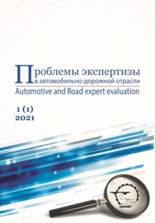
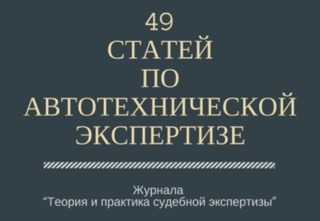
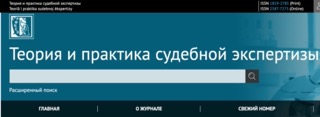

# Полезные ресурсы

!!! info inline ""

    { align=left } 

* **Научно-практический журнал "Проблемы экспертизы в автомобильно-дорожной отрасли"** [ссылка](https://areemadi.ru/).  

<small>Журнал «Проблемы экспертизы в автомобильно-дорожной отрасли» Московского автомобильно-дорожного государственного технического университета (МАДИ) и АНО «СОЮЗЭКСПЕРТИЗА» Торгово-промышленной палаты РФ.  
Журнал распространяется бесплатно. Публикация статей в журнале также производится совершенно бесплатно.
Журнал является периодическим научно-практическим изданием, основной задачей которого является обеспечение возможности специалистам обмениваться опытом, обсуждать проблемы экспертной деятельности в автомобильно-дорожной сфере и проводить совместный поиск способов их решения.  
Основная цель издания — совершенствование экспертной деятельности в Российской Федерации, повышение качества экспертных услуг в автомобильно-дорожной отрасли и квалификации специалистов, а также обеспечение их необходимой нормативно-правовой и апробированной методической информацией.  
На страницах журнала предполагаются публикации наиболее интересных и значимых научно-прикладных и научно-методических разработок, которые будут охватывать такие направления экспертной деятельности автомобильно-дорожной отрасли как: автотехническая экспертиза; экспертиза строительной, коммунальной, сельскохозяйственной, дорожно-строительной техники; дорожно-строительная экспертиза; экспертиза в таможенном деле; экспертиза безопасности дорожного движения; другие экспертизы, связанные с автомобильной и дорожно-строительной отраслью.</small>

!!! info inline ""

    { align=left } 

* **49 рецензируемых статей по автотехнической экспертизе"** [ссылка](https://forensicscience.ru/2017/11/25/49-recenziruemyx-statej-po-avtotexnicheskoj-ekspertize/).  

<small>Статьи из рецензируемого научно-практического журнала “Теория и практика судебной экспертизы” (ТиПСЭ).  
ТиПСЭ издается с 2006 года Федеральным бюджетным учреждением Российского федерального центра судебной экспертизы (ФБУ РФЦСЭ) при Министерстве юстиции Российской Федерации – головной научно-методической организации системы судебно-экспертных учреждений Минюста России.  
АНО “НИИ Судебной Экспертизы” десять лет ведет классификацию рецензируемых научных статей по судебной экспертизе. С недавнего времени ФБУ РФЦСЭ открыло доступ к номерам журнала ТиПСЭ, что позволяет нам готовить и публиковать перечень наиболее интересных статей в разрезе судебно-экспертных специальностей.  
В подготовленном материале приведены ссылки на статьи по автотехнической экспертизе с аннотациями и комментариями. Материал повышает уровень компетенций экспертов автотехников и закрывает пробелы знаний имеющихся в классической литературе по данной тематики. Перечень статей приводится по дате публикации в ТиПСЭ.</small>

!!! info inline ""

    { align=left } 

* **Журнал «Теория и практика судебной экспертизы»** [ссылка](https://www.tipse.ru/jour/issue/archive).  

<small>Важнейшими задачами журнала «Теория и практика судебной экспертизы» являются:

- обобщение научных и практических достижений в области судебно-экспертной деятельности (СЭД)  
- анализ актуальных проблем теории и практики судебных экспертиз и исследований  
- методическая и информационная поддержка работников судебно-экспертных учреждений, судей, следователей, работников прокуратуры и всех заинтересованных лиц  
- повышение квалификации судебных экспертов государственных и негосударственных судебно-экспертных учреждений.  

Концепция издания предполагает публикацию актуальных наработок в области судебной экспертизы, результатов научно-практических исследований, методических материалов. На страницах журнала происходит обмен опытом по организации СЭД, производству судебных экспертиз различных родов и видов.  
Аудиторией и авторами журнала являются сотрудники государственных и негосударственных судебно-экспертных учреждений, работники судов, прокуратуры, органов предварительного расследования, адвокаты, преподаватели и слушатели вузов, специализирующихся в СЭД.  
В журнале освещаются вопросы по совершенствованию и изменению нормативно-правовой базы СЭД, ее организационно-правовая сторона. Большое значение редакция журнала уделяет вопросам подготовки судебных экспертов. Основной объем издания посвящен обмену практическим опытом производства экспертиз – на страницах журнала публикуются статьи как по обобщению экспертной практики экспертиз разных видов, так и отдельные экспертные исследования, с которыми экспертам приходилось сталкиваться в ходе работы.</small>